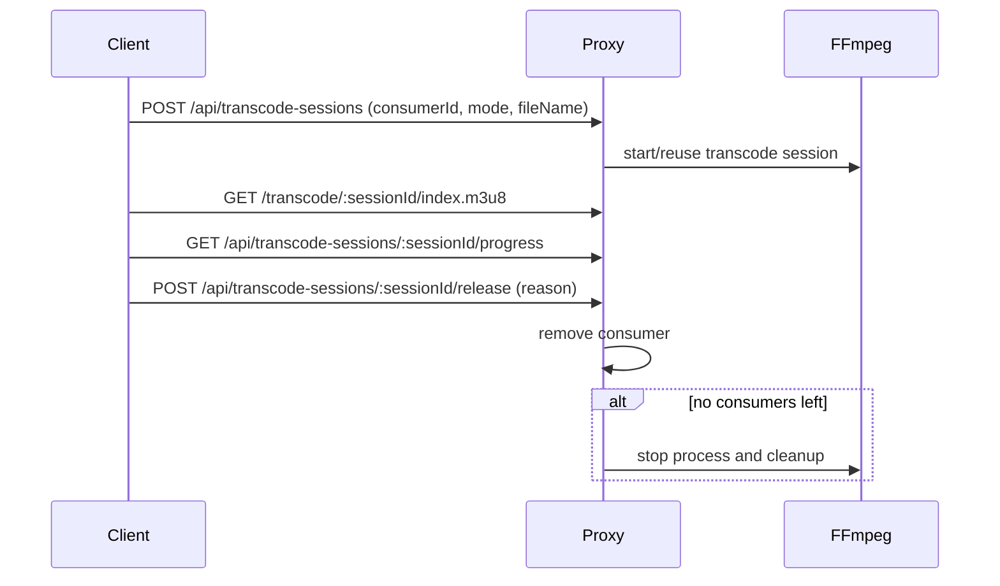

# Torrent Proxy Client

`@torrent-tv/proxy` is a lightweight Node.js service that turns torrent content into HTTP endpoints that are easy to consume from web players and backend services.

It is designed for setups where a central registry/UI needs a simple direct media URL, while the actual torrent fetching happens on a separate edge/client machine.

## Why this exists

- Browsers and many media players cannot consume torrents directly.
- This service exposes torrent files through regular HTTP (`/stream`) with range support.
- It can optionally create HLS sessions with AAC audio when direct playback is not suitable.
- It can also create HLS sessions with video transcoding when browser-side decode still fails.
- It registers itself in an external registry service and sends heartbeats, so other services can discover and use it.

## What it does

- Runs a Fastify server with health and media endpoints.
- Accepts torrent sources (`magnet` or base64 `.torrent`) and returns a stable `sourceKey`.
- Streams a selected file from a torrent by `fileIndex`.
- Builds a playback plan (`direct` vs `hls`) based on detected audio codec and returns both audio/video codecs.
- Starts ffmpeg-based HLS transcoding sessions (`audio-only` or `video+audio`) and serves generated playlist/segments.
- Tracks multi-client consumers per transcode session and stops ffmpeg when the last consumer releases.

## Requirements

- Node.js 18+ (ESM and built-in `fetch` are required).
- npm.
- ffmpeg is required only when audio transcoding is enabled.
  - By default, the package uses `ffmpeg-static`.
  - You can override binary path with `--ffmpeg-bin`.
  - You can disable transcoding with `--no-transcode-audio`.

## Install

```bash
npm install
```

## Run

```bash
npm start -- --server-url http://localhost:3000
```

Minimal required argument:

- `--server-url <url>`: base URL of your registry server.

Useful optional arguments:

- `--host <host>`: bind host (default `127.0.0.1`).
- `--port <port>`: preferred local port (default `9090`; first free port in range is selected).
- `--public-base-url <url>`: externally reachable base URL advertised to registry.
- `--id <id>`: stable proxy client id.
- `--name <name>`: display name for registry.
- `--token <token>`: token sent to register/heartbeat endpoints.
- `--ffmpeg-bin <path>`: custom ffmpeg binary path.
- `--no-transcode-audio`: disable HLS audio transcoding.
- `--help`: print all options with descriptions and examples, then exit.

## HTTP API

Base URL examples below use `http://127.0.0.1:9090`.

### Health

```bash
curl http://127.0.0.1:9090/health
curl http://127.0.0.1:9090/healthz
```

### 1) Register a source

```bash
curl -X POST http://127.0.0.1:9090/api/sources \
  -H "Content-Type: application/json" \
  -d '{
    "sourceType": "magnet",
    "source": "magnet:?xt=urn:btih:..."
  }'
```

Response:

```json
{ "sourceKey": "..." }
```

Supported `sourceType` values:

- `magnet`: magnet URI string.
- `torrent`: base64-encoded raw `.torrent` file bytes.

### 2) Build playback plan

```bash
curl -X POST http://127.0.0.1:9090/api/playback-plan \
  -H "Content-Type: application/json" \
  -d '{
    "sourceKey": "<sourceKey>",
    "fileIndex": 0,
    "userAgent": "Mozilla/5.0"
  }'
```

Typical response:

```json
{
  "mode": "direct",
  "directUrl": "http://127.0.0.1:9090/stream?sourceKey=...&fileIndex=0",
  "reason": "audio-codec-supported",
  "audioCodec": "aac",
  "videoCodec": "h264"
}
```

`mode` can be:

- `direct`: play `directUrl` directly.
- `hls`: create an HLS session, then use playlist URL.

### 3) Direct stream endpoint

```bash
curl -v "http://127.0.0.1:9090/stream?sourceKey=<sourceKey>&fileIndex=0"
```

Or without pre-registering source:

```bash
curl -v "http://127.0.0.1:9090/stream?sourceType=magnet&source=magnet:?xt=...&fileIndex=0"
```

The endpoint supports HTTP Range requests.

### 4) Create HLS transcode session (optional)

```bash
curl -X POST http://127.0.0.1:9090/api/transcode-sessions \
  -H "Content-Type: application/json" \
  -d '{
    "sourceKey": "<sourceKey>",
    "fileIndex": 0,
    "transcodeVideo": false,
    "consumerId": "browser-session-uuid",
    "fileName": "Episode01.mkv"
  }'
```

Set `"transcodeVideo": true` to force video transcoding (for browser decode fallback cases).

Response:

```json
{
  "sessionId": "...",
  "playlistPath": "/transcode/<sessionId>/index.m3u8"
}
```

Open playlist as:

`http://127.0.0.1:9090/transcode/<sessionId>/index.m3u8`

### 5) Poll transcode progress

```bash
curl "http://127.0.0.1:9090/api/transcode-sessions/<sessionId>/progress"
```

Response includes transcode and warmup metrics:
- `percent`, `processedSeconds`, `totalSeconds`, `remainingSeconds`, `speed`
- `warmupPercent`, `warmupRemainingSeconds`

### 6) Release transcode consumer

```bash
curl -X POST http://127.0.0.1:9090/api/transcode-sessions/<sessionId>/release \
  -H "Content-Type: application/json" \
  -d '{
    "consumerId": "browser-session-uuid",
    "reason": "pagehide"
  }'
```

When the last consumer is released, proxy disposes the session and stops ffmpeg.

## End-to-end flow

1. Start proxy client with `--server-url`.
2. Register torrent source via `/api/sources` and get `sourceKey`.
3. Request `/api/playback-plan`.
4. If plan is `direct`, use `directUrl`.
5. If plan is `hls`, create session and play generated playlist.
6. Poll `/progress` for UI updates, then release session on client stop/close.

## Transcode Session Lifecycle



## Notes

- HLS session files are stored in OS temp directory and cleaned up automatically.
- Transcode sessions are cached by `sourceKey:fileIndex:mode`.
- ffmpeg is bundled via `ffmpeg-static` for out-of-the-box availability.
- Source registry is in-memory and bounded (old entries are evicted).

## License

This project is distributed under GPL-3.0-or-later (see `LICENSE`).

Third-party dependencies keep their own licenses. In particular, bundled ffmpeg binaries
provided by `ffmpeg-static` are GPL-compatible.

