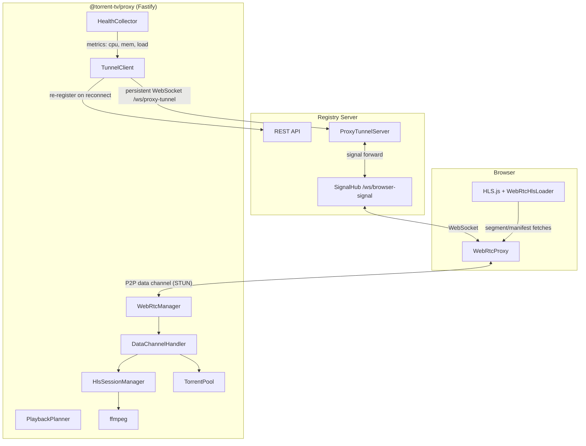
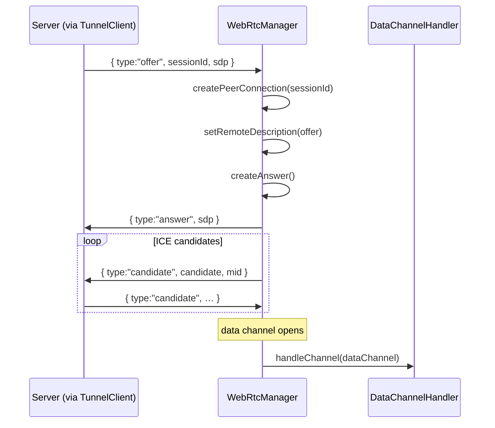
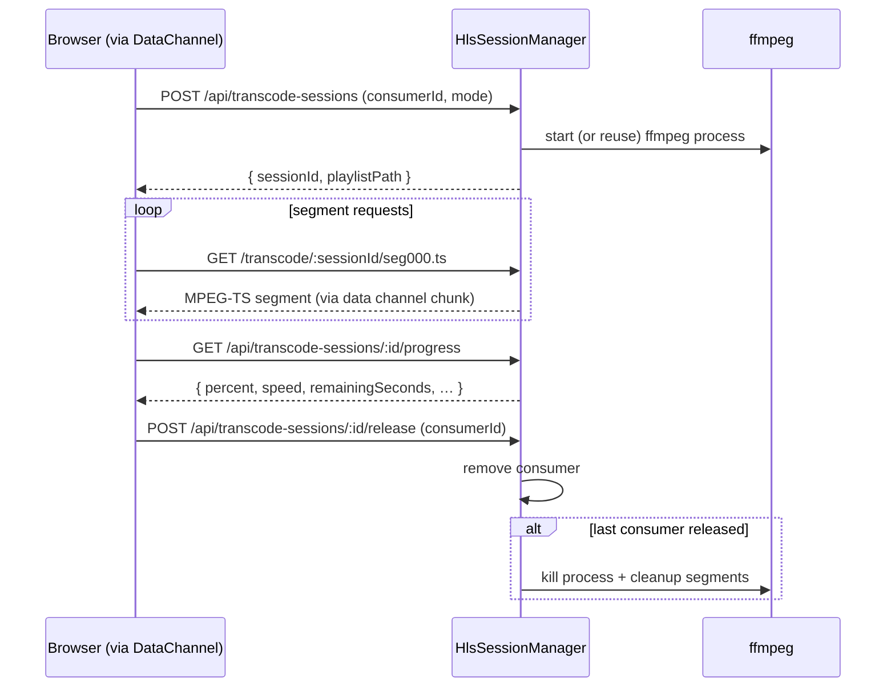
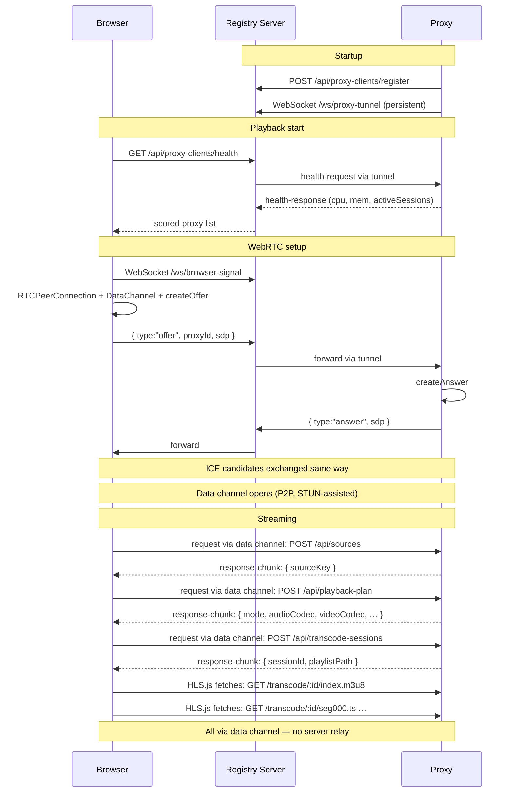

# @torrent-tv/proxy

A lightweight Node.js service that streams torrent content to browsers via a direct WebRTC P2P data channel or, when needed, HTTP. It handles torrent fetching, codec detection, and on-demand HLS transcoding with ffmpeg.

## Why this exists

- Browsers cannot consume torrents directly.
- This service exposes torrent files through HTTP (`/stream`) with Range support, and through a WebRTC data channel for NAT-traversed streaming.
- It can transcode audio (or video + audio) to HLS on demand so the browser can always play the content regardless of codec support.
- It registers itself in an external registry server and maintains a persistent tunnel WebSocket so the server can route browser requests and WebRTC signals to it.

## Architecture Overview



## Service Internals

### TunnelClient

Opens one persistent WebSocket to the registry server's `/ws/proxy-tunnel` endpoint on startup.
Reconnects automatically with back-off on unexpected close.

Handles three inbound message types from the server:

| Message type | What the proxy does |
|---|---|
| `health-request` | Calls `HealthCollector`, sends `health-response` back through tunnel |
| `signal` | Forwards SDP offer or ICE candidate to `WebRtcManager` |
| `relay-request` | Fetches the path from local Fastify, streams `relay-response` back |

### WebRtcManager

Manages RTCPeerConnection sessions keyed by `sessionId`. On receiving an SDP offer from the server it creates a peer connection using [`node-datachannel`](https://github.com/murat-dogan/node-datachannel), generates an answer, and exchanges ICE candidates through the tunnel. When the data channel opens it hands it off to `DataChannelHandler`.



### DataChannelHandler

Receives JSON `request` messages over the data channel and dispatches them to the proxy's local Fastify server. Responses are streamed back as base64 `response-chunk` messages.

**Wire protocol (browser ↔ proxy):**

| Direction | Type | Key fields |
|---|---|---|
| Browser → Proxy | `request` | `requestId`, `method`, `path`, `query`, `headers`, `body` |
| Proxy → Browser | `response-start` | `requestId`, `status`, `headers` |
| Proxy → Browser | `response-chunk` | `requestId`, `data` (base64), `done: true\|false` |
| Proxy → Browser | `response-error` | `requestId`, `error` |
| Browser → Proxy | `ping` | `id` |
| Proxy → Browser | `pong` | `id` |

### HealthCollector

Collects system-level health metrics on every request from the server:

| Metric | Range | Description |
|---|---|---|
| `cpuLoad` | 0 – ∞ | 1-minute load average divided by CPU count (>1 = overloaded) |
| `memFree` | 0 – 1 | Free memory fraction |
| `activeSessions` | 0 – ∞ | Number of active HLS transcode sessions |

The browser uses these metrics together with tunnel RTT to score proxies:

```
score = memFree × 0.4 + (1 - clamp(cpuLoad, 0, 1)) × 0.4 − (rttMs / 2000) × 0.2
```

### HlsSessionManager & ffmpeg

Creates and manages ffmpeg-based HLS transcode sessions. Sessions are keyed by `sourceKey:fileIndex:mode` and shared across consumers.



## HTTP API

Base URL examples use `http://127.0.0.1:9090`.

### Health

```bash
GET /health
GET /healthz
```

### Register a source

```bash
POST /api/sources
Content-Type: application/json

{
  "sourceType": "magnet",         # or "torrent" (base64-encoded bytes)
  "source": "magnet:?xt=urn:btih:…"
}
```

Response: `{ "sourceKey": "…" }`

### Build playback plan

```bash
POST /api/playback-plan
Content-Type: application/json

{
  "sourceKey": "<sourceKey>",
  "fileIndex": 0,
  "userAgent": "Mozilla/5.0 …"
}
```

Response:

```json
{
  "mode": "direct",
  "directUrl": "http://127.0.0.1:9090/stream?sourceKey=…&fileIndex=0",
  "reason": "audio-codec-supported",
  "audioCodec": "aac",
  "videoCodec": "h264"
}
```

`mode` is `"direct"` or `"hls"`.

### Direct stream

```bash
GET /stream?sourceKey=<key>&fileIndex=0
```

Supports HTTP Range requests.

### Create HLS transcode session

```bash
POST /api/transcode-sessions
Content-Type: application/json

{
  "sourceKey": "<key>",
  "fileIndex": 0,
  "transcodeVideo": false,
  "consumerId": "uuid",
  "fileName": "Episode01.mkv"
}
```

Response: `{ "sessionId": "…", "playlistPath": "/transcode/<id>/index.m3u8" }`

### Poll transcode progress

```bash
GET /api/transcode-sessions/:sessionId/progress
```

Returns: `percent`, `processedSeconds`, `totalSeconds`, `remainingSeconds`, `speed`, `warmupPercent`, `warmupRemainingSeconds`.

### Release consumer

```bash
POST /api/transcode-sessions/:sessionId/release
Content-Type: application/json

{ "consumerId": "uuid", "reason": "pagehide" }
```

When the last consumer is released, the transcode session stops and temp files are cleaned up.

## Requirements

- Node.js 18+ (ESM, built-in `fetch`).
- ffmpeg is required only when transcoding is enabled (bundled via `ffmpeg-static` by default).

## Run

```bash
npm install
npm start -- --server-url http://localhost:3000
```

### CLI Options

| Option | Default | Description |
|--------|---------|-------------|
| `--server-url` | — | **(Required)** Base URL of the registry server |
| `--host` | `127.0.0.1` | Bind host |
| `--port` | `9090` | Preferred local port (auto-increments if taken) |
| `--public-base-url` | — | Externally reachable base URL advertised to registry |
| `--id` | auto | Stable proxy client ID |
| `--name` | hostname | Display name in registry |
| `--token` | — | Auth token for register/heartbeat |
| `--ffmpeg-bin` | bundled | Path to custom ffmpeg binary |
| `--no-transcode-audio` | — | Disable HLS audio transcoding |
| `--help` | — | Print all options and exit |

## Docker

```bash
docker build -t torrent-tv-proxy .
docker run torrent-tv-proxy --server-url http://my-server:8080
```

## Full End-to-End Flow



## Notes

- HLS session temp files are in the OS temp directory and cleaned up automatically.
- Transcode sessions are cached by `sourceKey:fileIndex:mode` and shared across consumers.
- The source registry is in-memory and bounded (old entries evicted).
- The proxy reconnects to the server automatically on tunnel disconnect.

## License

GPL-3.0-or-later (see `LICENSE`). Third-party dependencies keep their own licenses.
Bundled ffmpeg binaries (`ffmpeg-static`) are GPL-compatible.
