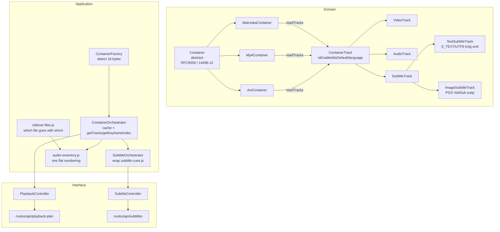

# Container & Track architecture

Domain → Application → Interface, per RFC 9559 (Matroska) and ISO/IEC 14496-12 (MP4).

## Two axes, and what is NOT a third

Everything here is placed on exactly two axes: **which container** a track lives
in, and **what kind of track** it is (video / audio / subtitle). A file lying
beside the video — a dub as `<name>.mka`, subtitles as `<name>.ass` — is not a
third kind of anything:

- a `.mka` **is** Matroska. `ContainerFactory` sniffs it, `MatroskaContainer`
  reads its `TrackEntry` list, and out comes an `AudioTrack` with its language,
  title and flags. It differs from the picture's own file only in having no
  video track. The same holds for `.m4a` and `Mp4Container`;
- "external" is therefore not a TYPE. It is the answer to WHERE a track's bytes
  are, and that is torrent knowledge — which this layer must not have
  (`ContainerFactory`: no torrent knowledge; `ContainerOrchestrator`:
  transport-agnostic). The pairing of a sidecar file with a picture lives in
  `services/sidecar-files.js`, and the numbered list a viewer chooses from lives
  in `services/audio-inventory.js`. Both are pure and both are application-layer.

A class called `ExternalSubtitleFile` used to sit in `tracks/` asserting the
opposite. It did not extend `ContainerTrack`, duplicated four of its fields, and
was imported by nothing; it was deleted rather than extended. Nothing replaced
it — a subtitle file beside the video is a `TextSubtitleTrack` whose bytes are
read from another file, and a raw `.srt` needs no `Container` subclass because
it has no track table and no index to read: the whole file is the payload, and
`SubtitleController` already reads it as such.

## Who answers what — the rule

A fact the container DECLARES is read from the container. A fact only the media
itself has is measured from the media, which means ffmpeg.

That is the whole boundary, and it is not about speed. Speed is a consequence:
this layer asks for the smallest region that holds the answer — 64 KB of header,
the Cues block, a sample table — while ffmpeg cannot be asked for a bounded
region at all. Its input analysis pulls megabytes before it will say anything,
and over a torrent those megabytes may not exist yet. Measured 2026-09-03 on one
`.mka`: this layer read its header in **8 ms**, and an ffmpeg reading the same
header of the same file through the proxy's own `/stream`, in the same second,
took **8121 ms** — and spent all of it waiting for a DURATION its caller did not
want, because its early exit is gated on one.

So ffmpeg keeps exactly three jobs, and nothing else:

1. producing media — the encode run;
2. measuring THIS MACHINE — encoder detection and its strict test, decode
   calibration, the contention penalty;
3. answering what the container does not declare — above all keyframe positions
   in a container with no index, where a packet scan is the only source. Even
   there the container is asked FIRST: measured, the container index gave 570
   keyframes in 0.8 s from two point reads of 16 KB, while a scan of the same
   file found 77 in 45 s and did not finish.

`null` in `ContainerMediaInfo` means the container does not declare the field.
That is a final answer about the container, and the point at which a caller may
go to the media — not "unknown, ask again".

## Where byte access lives, and why not on a track

A `ContainerTrack` is a DECLARATION. It carries no `readRange` and no file
identity, and it should not: byte access is the `Container`'s, injected as
`readRange(start, end)` and bound to one file.

The obvious-looking improvement — hand the track a reader so it can fetch its own
bytes — was reviewed on 2026-09-03 and is **not** the right shape:

- for video and audio, this layer never reads the payload at all. It goes to
  ffmpeg by URL, where seeking and gigabytes belong. A `readRange` on a
  `VideoTrack` would be a capability with no consumer, inviting reads of a size
  this path is not built for;
- tracks cross the worker boundary as PLAIN OBJECTS (`plainTrack()`), because a
  class instance does not survive it as a class. A back-reference to a container
  cannot cross either, so such a track would be able to read its own bytes only
  on the thread where the container is already at hand.

What IS split, and is worth closing: `SubtitleTrack` carries `clusterPositions`
and `samples` — byte POSITIONS — while the reading of those positions lives in
`torrent-worker/subtitle-cues.js`, which builds a `readRange` of its own. Two
halves of one action in two layers.

The shape that closes it is `Container.readCuesOf(track)` — the container already
holds `readRange`, and the series `readTracks` / `readKeyframeIndex` /
`readMediaInfo` / `cueTextOf` is exactly where "ask the container" belongs.

**It is not done yet, and the obstacle is real rather than effort.** The two
readers want different read POLICIES over the same file: the track table fetches
what is missing from the swarm (`readFetching`), while the cue walk deliberately
reads only what is already downloaded (`readHeld`) so that turning subtitles on
never pulls bytes the viewer is not waiting for. One container instance per file
holds one `readRange`, so as things stand it cannot serve both. Resolving that —
a read policy per call, or something else — is the design question to answer
before the move, and answering it in passing would settle it by accident.

## Layers

## Class responsibilities (spec-grounded)

| Class | Spec section | Fields | Not responsible |
|---|---|---|---|
| `ContainerTrack` | RFC9559 TrackEntry common + ISO 14496-12 tkhd/mdhd/hdlr/elng | `trackNumber`, `declaredIndex`, `codecId`, `language`/`languageBcp47` (MUST rule), `name`, `isEnabled` (0xB9 / track_enabled), `isDefault`+`declaresDefault` (0x88) | Type-specific flags |
| `VideoTrack` | RFC9559 Video, ISO 14496-12 tkhd width/height, stsd | `width/height/display*`, `fps`, `isHdr`, `bitDepth` | Subtitle flags |
| `AudioTrack` | RFC9559 FlagOriginal 0x55AE, FlagCommentary 0x55AF, FlagVisualImpaired 0x55AC | `isOriginal/isCommentary/isVisualImpaired`, `channels/samplingFrequency` | FlagForced |
| `SubtitleTrack` | RFC9559 FlagForced 0x55AA (subtitle-only), FlagHearingImpaired 0x55AB | `isForced/isHearingImpaired`, `clusterPositions`/`samples` | Video dims |
| `TextSubtitleTrack` | `S_TEXT/UTF8, S_TEXT/ASS, tx3g, wvtt` | `toVtt()` convertible | Image tracks |
| `sidecar-files.js` | — (torrent naming) | which files of a torrent are one picture's sound and subtitles | what is inside them |
| `audio-inventory.js` | RFC9559 audio flags, merged against ffmpeg's numbering | one flat number per soundtrack → `(fileIndex, 0:a:N)` | display labels |
| `ImageSubtitleTrack` | `S_HDMV/PGS, S_VOBSUB, subp, clcp` | kept for `declaredIndex` alignment | Conversion |
| `MatroskaContainer` | RFC9559 SeekHead, Tracks, Cues, Clusters | single Tracks walk for all types, EBML via `ebml-reader.js` | HTTP |
| `Mp4Container` | ISO 14496-12 moov/trak/tkhd/mdhd/hdlr/elng/stbl | `alternate_group` grouping, packed language, `tx3g` forced bits | Torrent |
| `AviContainer` | RIFF AVI idx1 | `AVIIF_KEYFRAME` keyframe times | Tracks beyond video |

`VideoTrack` never carries `isForced` — spec states FlagForced "Applies only to subtitles". Placing it in base would pollute video with irrelevant state.

## Orchestrators & Controllers

- `ContainerFactory.create({readRange,fileSize})` — sniffs 16 bytes, returns precise `Container` subclass. No torrent knowledge.
- `ContainerOrchestrator` — per-file cache (`sourceKey:fileIndex`), `getTracks()` / `getKeyframeIndex()`. Transport-agnostic.
- `SubtitleOrchestrator` — wraps `torrent-worker/subtitle-cues.js` (`planFor`, `cuesHeldFor`, `warmSubtitleCues`) behind `ContainerTrack` abstraction. Routes depend on this, not on worker directly.
- `PlaybackController` / `SubtitleController` — thin interface adapters; `routes/api/*` delegate to them, handle HTTP headers (`X-Subtitle-Language`, `X-Subtitle-Cursor`) only.

## Legacy

`services/container-index/` remains as internal detail used by `container/*`. Direct imports from routes are deprecated — use `orchestrators/` and `controllers/` instead.

## Flags matrix

| Flag | Matroska ID | Applies to | Base or subclass |
|---|---|---|---|
| `FlagEnabled` | 0xB9 default 1 | all | `ContainerTrack` |
| `FlagDefault` | 0x88 default 1 | all | `ContainerTrack` (`declaresDefault`) |
| `Language` | 0x22B59C | all | `ContainerTrack` |
| `LanguageBCP47` | 0x22B59D MUST | all | `ContainerTrack` |
| `FlagForced` | 0x55AA | subtitle only | `SubtitleTrack` |
| `FlagHearingImpaired` | 0x55AB | subtitle | `SubtitleTrack` |
| `FlagVisualImpaired` | 0x55AC | audio (descriptive) + subtitle | `AudioTrack`/`SubtitleTrack` |
| `FlagOriginal` | 0x55AE | audio | `AudioTrack` |
| `FlagCommentary` | 0x55AF | audio | `AudioTrack` |
| `track_enabled` | tkhd 0x000001 | all | `ContainerTrack` |
| `alternate_group` | tkhd | audio/video alternates | `ContainerTrack.alternateGroup` |
| `elng` | 14496-12 §8.4.6 | all | `ContainerTrack.languageBcp47` |
