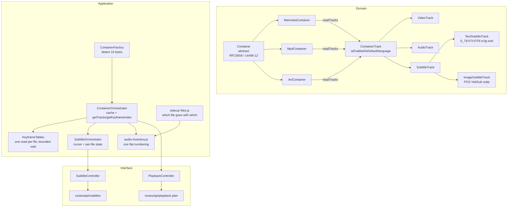

# Container & Track architecture

Domain → Application → Interface, per RFC 9559 (Matroska) and ISO/IEC 14496-12 (MP4).

## Two axes, and what is NOT a third

Everything here is placed on exactly two axes: **which container** a track lives
in, and **what kind of track** it is (video / audio / subtitle). A file lying
beside the video — a dub as `<name>.mka`, subtitles as `<name>.ass` — is not a
third kind of anything:

- a `.mka` **is** Matroska. `ContainerFactory` sniffs it, `MatroskaContainer`
  reads its `TrackEntry` list, and out comes an `AudioTrack` with its language,
  title and flags. It differs from the picture's own file only in having no
  video track. The same holds for `.m4a` and `Mp4Container`;
- "external" is therefore not a TYPE. It is the answer to WHERE a track's bytes
  are, and that is torrent knowledge — which this layer must not have
  (`ContainerFactory`: no torrent knowledge; `ContainerOrchestrator`:
  transport-agnostic). The pairing of a sidecar file with a picture lives in
  `services/sidecar-files.js`, and the numbered list a viewer chooses from lives
  in `services/media/audio-inventory.js`. Both are pure and both are application-layer.

A class called `ExternalSubtitleFile` used to sit in `tracks/` asserting the
opposite. It did not extend `ContainerTrack`, duplicated four of its fields, and
was imported by nothing; it was deleted rather than extended. Nothing replaced
it — a subtitle file beside the video is a `TextSubtitleTrack` whose bytes are
read from another file, and a raw `.srt` needs no `Container` subclass because
it has no track table and no index to read: the whole file is the payload, and
`SubtitleController` already reads it as such.

## Who answers what — the rule

A fact the container DECLARES is read from the container. A fact only the media
itself has is measured from the media, which means ffmpeg.

That is the whole boundary, and it is not about speed. Speed is a consequence:
this layer asks for the smallest region that holds the answer — 64 KB of header,
the Cues block, a sample table — while ffmpeg cannot be asked for a bounded
region at all. Its input analysis pulls megabytes before it will say anything,
and over a torrent those megabytes may not exist yet. Measured 2026-09-03 on one
`.mka`: this layer read its header in **8 ms**, and an ffmpeg reading the same
header of the same file through the proxy's own `/stream`, in the same second,
took **8121 ms** — and spent all of it waiting for a DURATION its caller did not
want, because its early exit is gated on one.

So ffmpeg keeps exactly three jobs, and nothing else:

1. producing media — the encode run;
2. measuring THIS MACHINE — encoder detection and its strict test, decode
   calibration, the contention penalty;
3. answering what the container does not declare — above all keyframe positions
   in a container with no index, where a packet scan is the only source. Even
   there the container is asked FIRST: measured, the container index gave 570
   keyframes in 0.8 s from two point reads of 16 KB, while a scan of the same
   file found 77 in 45 s and did not finish.

`null` in `ContainerMediaInfo` means the container does not declare the field.
That is a final answer about the container, and the point at which a caller may
go to the media — not "unknown, ask again".

## A read that has not arrived is not an answer

Every read a container makes goes through `strictReader` (`container/unavailable.js`):
it answers with every byte asked for, or throws `BytesUnavailable`. A reading has
therefore four outcomes — the value; a proven absence ("this file has no Cues");
a refusal of ours, stated with its reason and size (an MP4 `moov` larger than
this program reads whole: `moovRefused`); and "not here yet". Only the first
three are facts about the file, and only they are kept — by the container, by
`ContainerOrchestrator`, by `KeyframeTables` and by `SubtitleCues`.

Until 2026-10-01 "not here yet" came back as `null`, the value the readers
return for an absent element. A subtitle plan read while its Cues table was
downloading was kept as "no clusters", and an embedded track showed nothing for
a whole session; the keyframe table, the container choice, the track table,
MP4's `moov` and AVI's `idx1` had the same shape
(`research/subtitles-never-appear-2026-10-01.md`).

## Elements are read where they lie

Matroska's top-level elements are found by walking their HEADERS from the
Segment's start to the first cluster, each costing only its header, and from the
SeekHead for what lies after the clusters — so a Cues element stored before the
clusters with no SeekHead entry (RFC 9559 §6.4) is found. Elements are then read
by their own size through `container/ebml-stream.js`, one portion at a time; the
portion is the torrent's piece length, handed in, never chosen here. Data that
is not needed is skipped without being assembled; a needed element larger than
one portion is refused by name. There is no fixed window for the Cues table,
the Tracks element or a cluster any more.

## Where byte access lives, and why not on a track

A `ContainerTrack` is a DECLARATION. It carries no `readRange` and no file
identity, and it should not: byte access is the `Container`'s, injected as
`readRange(start, end)` and bound to one file.

The obvious-looking improvement — hand the track a reader so it can fetch its own
bytes — was reviewed on 2026-09-03 and is **not** the right shape:

- for video and audio, this layer never reads the payload at all. It goes to
  ffmpeg by URL, where seeking and gigabytes belong. A `readRange` on a
  `VideoTrack` would be a capability with no consumer, inviting reads of a size
  this path is not built for;
- tracks cross the worker boundary as PLAIN OBJECTS (`plainTrack()`), because a
  class instance does not survive it as a class. A back-reference to a container
  cannot cross either, so such a track would be able to read its own bytes only
  on the thread where the container is already at hand.

**That split is closed.** `SubtitleTrack` carries `clusterPositions` and
`samples` — byte POSITIONS — and the reading of those positions is the
container's: `MatroskaContainer.readHeldCues` (over `container/matroska-clusters.js`)
and `Mp4Container.readHeldSamples`, beside `readTracks`, `readKeyframeIndex`,
`readMediaInfo` and `cueTextOf`.

The two readers want different read POLICIES over the same file: the track
table fetches what is missing from the swarm, while the cue walk reads only
what is already downloaded, so that turning subtitles on never pulls bytes the
viewer is not waiting for. **One container per file serves both**: it is built
with the fetching `readRange`, and the walk's reader of downloaded bytes — which
ranges are whole, a strict read of them, the portion, where viewers stand — is
handed to `readHeldCues` on every pass (`HeldReader`), because what is
downloaded changes between passes. The walk used to build a second container of
its own over the same file and read the head and the Cues table again, under a
different rule for a read that had not arrived.

What the container is NOT given is the torrent. `media/SubtitleCues.js` is
handed a `HeldFile` of plain functions by `server.js` and keeps only what is
genuinely its own: the found-order cursor a browser follows, the per-file
state, one walk of a file at a time, and taking back the cues of a cluster the
container withdraws.

## Where a cluster is, when the Cues table does not say

RFC 9559 §22.1 only recommends that each subtitle frame be referenced by the
Cues table, and a file may have none. `container/matroska-clusters.js` finds
clusters from the downloaded bytes: positions the file establishes (the first
cluster, every `CueClusterPosition` of every track), a chain of top-level
elements from each established one, and — only where the file has no Cues — a
search for the Cluster id. What the search finds is a candidate; it is used only
once every child is one §5.1.3 allows, exactly one Timestamp is present, the
children fill it exactly, every block names a declared track, and any CRC-32 or
PrevSize matches. A candidate that an established cluster turns out to contain
is withdrawn with its cues, and the browser removes them by number. The cluster
a viewer stands in is read first, then the one before it, and pushed at once.

The walk reads a cluster's STRUCTURE — every child's header and the first bytes
of each block, which name its track — and a subtitle block's data by its own
size. It never moves a picture's frames into the main thread: measured on the
addon host 2026-10-01, reading clusters a portion at a time moved every frame
of the film across the thread boundary, and the collector then took three times
as long as the walk. Each read also hands the loop back before the walk goes on,
because the torrent thread replies faster than the message port empties. The
search decides each candidate as it finds it; one accepted is followed by its
chain, and the search resumes where the chain ends, so a file whose clusters
follow one another is searched only up to the first cluster after each gap.

## Layers

```mermaid
flowchart TB
  subgraph Domain
    C[Container<br/>abstract<br/>RFC9559 / 14496-12]
    MC[MatroskaContainer]
    MpC[Mp4Container]
    AC[AviContainer]
    CT[ContainerTrack<br/>isEnabled/isDefault/language]
    VT[VideoTrack]
    AT[AudioTrack]
    ST[SubtitleTrack]
    TST[TextSubtitleTrack<br/>S_TEXT/UTF8 tx3g wvtt]
    IST[ImageSubtitleTrack<br/>PGS VobSub subp]
    C --> MC & MpC & AC
    CT --> VT & AT & ST
    ST --> TST & IST
    MC & MpC & AC -- readTracks --> CT
  end
  subgraph Application
    CF[ContainerFactory<br/>detect 16 bytes]
    KT[KeyframeTables<br/>one read per file, bounded wait]
    CO[ContainerOrchestrator<br/>cache + getTracks/getKeyframeIndex]
    SO[SubtitleOrchestrator<br/>cursor + per-file state]
    SF[sidecar-files.js<br/>which file goes with which]
    AI[audio-inventory.js<br/>one flat numbering]
    CF --> CO
    CO --> KT
    CO --> SO
    SF --> AI
    CO --> AI
  end
  subgraph Interface
    PC[PlaybackController]
    SC[SubtitleController]
    R1[routes/api/playback-plan]
    R2[routes/api/subtitles]
    PC --> R1
    SC --> R2
    CO --> PC
    SO --> SC
  end
```

## Class responsibilities (spec-grounded)

| Class | Spec section | Fields | Not responsible |
|---|---|---|---|
| `ContainerTrack` | RFC9559 TrackEntry common + ISO 14496-12 tkhd/mdhd/hdlr/elng | `trackNumber`, `declaredIndex`, `codecId`, `language`/`languageBcp47` (MUST rule), `name`, `isEnabled` (0xB9 / track_enabled), `isDefault`+`declaresDefault` (0x88) | Type-specific flags |
| `VideoTrack` | RFC9559 Video, ISO 14496-12 tkhd width/height, stsd | `width/height/display*`, `fps`, `isHdr`, `bitDepth` | Subtitle flags |
| `AudioTrack` | RFC9559 FlagOriginal 0x55AE, FlagCommentary 0x55AF, FlagVisualImpaired 0x55AC | `isOriginal/isCommentary/isVisualImpaired`, `channels/samplingFrequency` | FlagForced |
| `SubtitleTrack` | RFC9559 FlagForced 0x55AA (subtitle-only), FlagHearingImpaired 0x55AB | `isForced/isHearingImpaired`, `clusterPositions`/`samples` | Video dims |
| `TextSubtitleTrack` | `S_TEXT/UTF8, S_TEXT/ASS, tx3g, wvtt` | `toVtt()` convertible | Image tracks |
| `sidecar-files.js` | — (torrent naming) | which files of a torrent are one picture's sound and subtitles | what is inside them |
| `audio-inventory.js` | RFC9559 audio flags, merged against ffmpeg's numbering | one flat number per soundtrack → `(fileIndex, 0:a:N)` | display labels |
| `ImageSubtitleTrack` | `S_HDMV/PGS, S_VOBSUB, subp, clcp` | kept for `declaredIndex` alignment | Conversion |
| `MatroskaContainer` | RFC9559 SeekHead, Tracks, Cues, Clusters | single Tracks walk for all types, EBML via `ebml-reader.js` | HTTP |
| `Mp4Container` | ISO 14496-12 moov/trak/tkhd/mdhd/hdlr/elng/stbl | `alternate_group` grouping, packed language, `tx3g` forced bits | Torrent |
| `AviContainer` | RIFF AVI idx1 | `AVIIF_KEYFRAME` keyframe times | Tracks beyond video |

`VideoTrack` never carries `isForced` — spec states FlagForced "Applies only to subtitles". Placing it in base would pollute video with irrelevant state.

## Orchestrators & Controllers

- `ContainerFactory.create({readRange,fileSize})` — sniffs 16 bytes, returns precise `Container` subclass. No torrent knowledge.
- `ContainerOrchestrator` — per-file cache (`sourceKey:fileIndex`), `getTracks()` / `getMediaInfo()` / `getKeyframeIndex()`. Transport-agnostic.
- **The keyframe table is read once per file, and the container is not what remembers it.** `Container.readKeyframeIndex` parses and returns; each format implements `parseKeyframeIndex`. It used to keep the answer, and that made this the one fact stored in two places — here and in the file's `KeyframeTable` on the main thread. That copy had no reader, and since the parse itself moved to the main thread there is no second thread for a second copy to sit in.
- **`KeyframeTable` / `KeyframeTables` — the answer, and the policy around getting one.** The table is one object per file (`media/container/KeyframeTable.js`), held by everyone who reads that file rather than copied, so a read that lands after a session was made still reaches it. `media/KeyframeTables.js` reads it once per file whoever asks, joins the second asker to the read already running, bounds how long any one caller waits (`KEYFRAME_TABLE_BUDGET_MS`, measured), and never records a read that threw as an answer. Its reader is one function handed in at construction, so it knows nothing of torrents or HTTP. It is not `ContainerOrchestrator`: both live on the main thread, but that one keeps the file's container — which keeps its own Cues reading — and this keeps the answer the sessions hold and the wait around it. A read that has not arrived rejects with `BytesUnavailable` and is read again when pieces of the file arrive (`readAgainIfUnanswered`).
- **`answered` and `readable` are different questions.** `answered` says a reader came back; `readable` says it came back with times. A file that answered nothing must be re-encoded for ever (MPEG-TS: 669 real keyframes, no index of any kind); a file that has not answered is a shortage of bytes off the swarm. Held as loose fields in a bag of probe results nothing told them apart, and a passing shortage was written onto the file as a property of the bytes.
- **The second reader is the packet probe** (`media/keyframe-probe.js`): it finds keyframes by decoding, for containers that state no index. It is never waited for, and `KeyframeTable.learn` keeps the fuller answer whichever arrives second — measured 2026-08-02, a scan found 77 keyframes in 45 s without finishing against all 570 in 0.8 s from the index.
- `SubtitleOrchestrator` — wraps `media/SubtitleCues.js` (`cuesHeldFor`, `warmSubtitleCues`, `subtitleTracksOf`) behind the `ContainerTrack` abstraction, handed in by `server.js`. Routes depend on this. The reading itself is the file's one container's; `SubtitleCues` keeps the cursor and the per-file state.
- `PlaybackController` / `SubtitleController` — thin interface adapters; `routes/api/*` delegate to them, handle HTTP headers (`X-Subtitle-Language`, `X-Subtitle-Cursor`) only.

## Legacy

Everything a container states about ITSELF is in its own class: the track table,
the Cues, the keyframe times they name, the cluster positions, the blocks inside
a cluster, the MP4 sample table. `services/container-index/` no longer exists.
What was kept apart is `container/ebml-reader.js` — EBML element walking is the
format's grammar rather than any of its statements.

`ContainerFactory` is the one place that decides what a file IS. It sniffs the
header, because that is what the muxer wrote while a name is what somebody
typed, and it answers `readKeyframeIndex` for the same reason: doing it anywhere
else meant a third place making that decision. `ContainerFactory.byName` exists
for the one path that cannot sniff — the cue walk asks the swarm for nothing, so
a file whose head is not downloaded has only its name.

**Two readings of one file, and which answers.** ffmpeg's `-i` banner and the
container's own table both describe a file's tracks, and the rule is stated once
per media kind on `Container`. `alignWithBanner` lines them up by position and
CHECKS each pair on language or title; one pair agreeing on neither, or a length
that differs, drops the container reading whole, because a wrong flag is worse
than a missing one. `mergeSubtitleFlags`, `mergeAudioFlags` and
`mergeVideoFacts` then say which side answers for which field: flags the banner
cannot express come from the container; the coded size and frame rate come from
the probe, because the encoder receives what the decoder produced.

Direct imports from routes are deprecated — use `orchestrators/` and
`server/controllers/` instead.

## Flags matrix

| Flag | Matroska ID | Applies to | Base or subclass |
|---|---|---|---|
| `FlagEnabled` | 0xB9 default 1 | all | `ContainerTrack` |
| `FlagDefault` | 0x88 default 1 | all | `ContainerTrack` (`declaresDefault`) |
| `Language` | 0x22B59C | all | `ContainerTrack` |
| `LanguageBCP47` | 0x22B59D MUST | all | `ContainerTrack` |
| `FlagForced` | 0x55AA | subtitle only | `SubtitleTrack` |
| `FlagHearingImpaired` | 0x55AB | subtitle | `SubtitleTrack` |
| `FlagVisualImpaired` | 0x55AC | audio (descriptive) + subtitle | `AudioTrack`/`SubtitleTrack` |
| `FlagOriginal` | 0x55AE | audio | `AudioTrack` |
| `FlagCommentary` | 0x55AF | audio | `AudioTrack` |
| `track_enabled` | tkhd 0x000001 | all | `ContainerTrack` |
| `alternate_group` | tkhd | audio/video alternates | `ContainerTrack.alternateGroup` |
| `elng` | 14496-12 §8.4.6 | all | `ContainerTrack.languageBcp47` |
