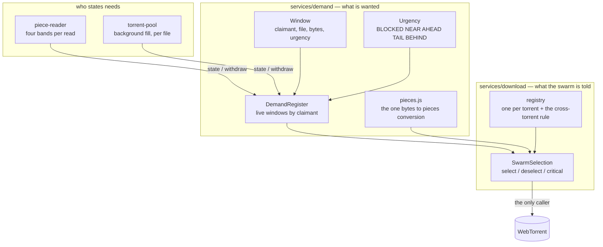

# Download architecture — what is wanted, and what the swarm is told

Two questions, kept apart, and neither of them is "which file".

## Two axes, and what is NOT a third

**What somebody needs** — a claimant, a file, a byte range, a level of urgency.
Stated in `services/demand/`. Knows nothing about WebTorrent, nothing about
pieces, nothing about the piece store: it is numbers and rules, and it is
testable without a torrent.

**What the swarm is told** — one class, `services/download/SwarmSelection.js`,
which reads the register and calls `select`, `deselect` and `critical`. It is
the only thing in this proxy that calls them.

"Which file" is not a third axis. A file nobody has stated a need for is simply
absent from the register, and a torrent is added with `deselect: true` so
nothing is fetched until something is stated. Before 2026-09-02 the library's
own default selected the whole torrent and this proxy undid that afterwards by
deselecting the files nobody had opened — so on a season pack every episode was
being fetched for as long as the viewer took to choose one.

## Layers



## The five levels

| level | what it is | stated |
|---|---|---|
| `BLOCKED` | the bytes a reader is stopped on | always; may take a block from a slow peer |
| `NEAR` | the rest of that reader's window | always |
| `AHEAD` | the lead the encoder will reach | always |
| `TAIL` | to the end of the file | only while nothing urgent is missing, anywhere |
| `BEHIND` | the gap left by a forward seek | only while nothing urgent is missing, anywhere |

## Why urgency is not a number handed to the library

Measured against the vendored WebTorrent 2.8.5. Selections are sorted by
priority **only when one is inserted**:

```js
this._selections.sort((a, b) => b.priority - a.priority)
```

and after a wire's pipeline is filled from a selection, that selection is moved
to the back of the whole non-zero group:

```js
function shufflePriority (i) {
  let last = i
  for (let j = i; j < self._selections.length && self._selections.get(j).priority; j++) last = j
  self._selections.swap(i, last)
}
```

So distinct non-zero numbers give an order once and a round robin thereafter.
Two things hold: non-zero rotates fairly, zero is always last.

The ordering is therefore kept in `DemandRegister.levelsToState`, by choosing
what to state at all, and the library is given only the distinction it honours —
`1` for anything wanted now, `0` for the speculative tail.

The rotation is wanted, not merely tolerated: with two viewers of one film both
stopped, both needs sit at `BLOCKED` and the swarm alternates between them
instead of always serving whoever asked first.

## Why the speculative levels are withdrawn rather than lowered

A peer that cannot help with anything urgent — it lacks those pieces, or every
block of them is reserved by somebody else — falls through the selection list to
whatever is below. With a permanently low priority it would then spend the
shared link on pieces nobody is waiting for, about a second of its own
throughput at a time (`PIPELINE_MAX_DURATION = 1`).

A withdrawn window is not in the download set at all, so there is nothing to
fall through to.

The condition is **global**, in `services/download/registry.js`, and not per
torrent: two films on one proxy share the link, so filling the tail of one while
a viewer of the other has a still picture spends the same bandwidth twice over.

## `select` against `critical` — two different things

`select(from, to, priority)` decides **what is asked for next**: it inserts into
the sorted selection list the picker walks.

`critical(from, to)` decides **whom it is asked of**. Every block of a piece is
reserved to exactly one wire; `piece.reserve()` returns `-1` once they all are,
and a fast idle peer walks past. The flag lets `_hotswap` take a block from the
slowest holder and give it to the asker:

```js
if (reservation === -1 && hotswap && self._hotswap(wire, index)) {
  reservation = piece.reserve()
}
```

Its thresholds are constants in the library, not settings: the asker must be
above 16 KB/s, the holder below 48 KB/s and at least twice as slow. So a holder
at 50 KB/s is never displaced, however long the piece has been waited for.
Whether that costs us anything is measured rather than assumed — `askFastestWiresFor`
counts the requests refused while every block was reserved, and the wait line
prints it. A number there would justify replacing `_hotswap` on the torrent
object; a zero says the thresholds are not what we are short of.

## Several viewers

- **Same file.** Each reader is its own claimant. Two stopped viewers put two
  disjoint ranges at `BLOCKED`, and the library's rotation alternates between
  them. Two readers wanting the same pieces are merged into one instruction.
- **Same torrent, different files.** The background fill is stated **per file**,
  from the furthest window in that file to that file's end. It used to take the
  furthest window across all files and the last piece across all files and claim
  everything between — with two viewers on two episodes of one release, that
  claimed every episode lying between them.
- **Different torrents.** One register and one selection each, and the
  speculative condition spans all of them.

## What was deleted, and why

- `claimWindow`, `releaseWindow`, `markCritical`, `clearCritical` in
  `piece-reader.js` — the reader no longer speaks to the library.
- `#reassertReaderWindows` in `torrent-pool.js` — it read the piece store's
  MEMORY claims and rebuilt download claims from them, because WebTorrent
  deletes a selection once satisfied. `SwarmSelection.reconcile` does that from
  the register, which is where the statement lives.
- `#updateBackgroundFill` and `#tailAfterWindows` — replaced by a stated need at
  the `TAIL` level, per file.
- `#syncSelections` — obsolete once nothing is selected by default.
- `setActiveFile` — dead: no caller anywhere in the repository.
- The two claim strategies and the environment variable that chose between them
  (`TORRENT_TV_READ_MODE`). Each read was assigned at random to one of them and
  the waits were sorted by which, and the comparison never decided anything: the
  split halved the sample, so on 2026-08-28 there were nine reads in one arm and
  three in the other against a threshold of ten, and on 2026-08-29 the two arms
  printed together for the first and only time as forty waits against one. Waits
  are now recorded by the LEVEL the reader was stopped in, which says whether a
  band is too narrow rather than whether banding is the wrong idea.

## What this does NOT do

The piece store keeps its own list of protected ranges for memory
(`protectRange` / `protectedRanges`). It is fed by the same readers with the
same windows, but it is a second list, and one of the two could still drift from
the other. Making the store read this register instead is the remaining half of
the deduplication; it was left out of the first release because the memory path
had just been rewritten and had not yet been seen in the field.
