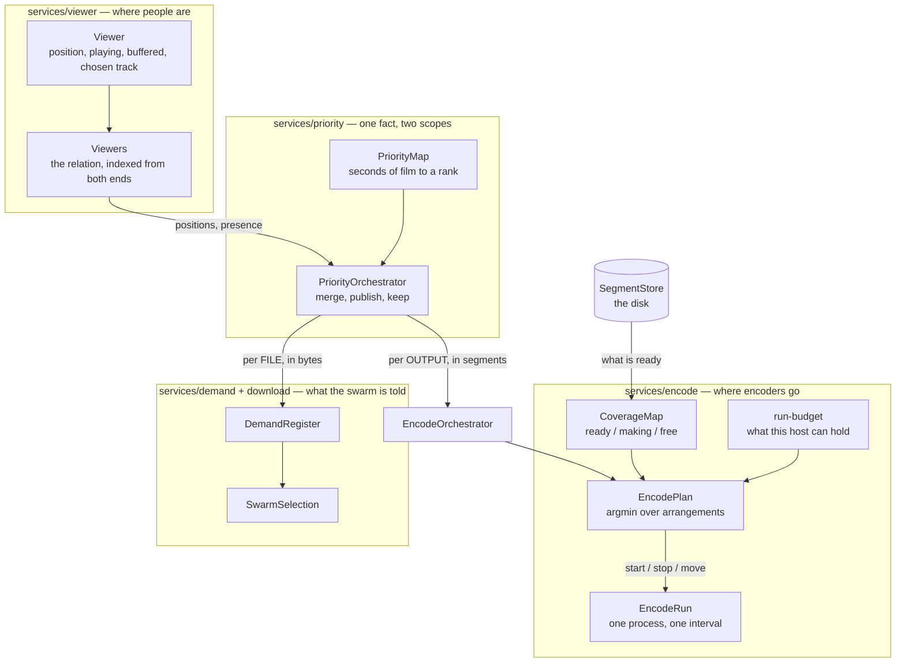

# Encode architecture — who decides where encoders go

One question, one answer, and the answer is arithmetic.

> Viewers are always independent and always reuse what can be reused. The
> number of encoders is however many are needed; how many are needed follows
> from which sets of output parameters are wanted and where the viewers stand
> inside each. Segments produced by ANY encoder are available to ANY viewer, and
> which viewer asked never enters the question.

## The one authority

`services/encode/EncodePlan.js` decides. Nothing else places an encoder,
nothing else takes one away for scheduling reasons, and there is exactly one
call to `#startEncodeRun` in the whole proxy — the one the plan asks through.

It decides from four things and no others:

| what | where it comes from |
|---|---|
| what is already made | the segment store, asked afresh before every decision |
| what is being made | the coverage map's live claims |
| what is wanted | the priority map of that output |
| how many the machine can hold | `run-budget.js`, from measurements of this host |

**No viewer reaches it.** `services/encode/` and
`services/orchestrators/EncodeOrchestrator.js` do not import the viewer layer,
name a consumer id, or hold a person. What crosses is a priority map: zones of
segment numbers with a rank and a real time, and nobody's name on it.

## Viewers become a map, and that is the whole crossing



## Two scopes of one map, and both are right

The map is built from where the viewers are, once, and read at two scopes.

**Per FILE, for the swarm.** The picture, a quality step and a soundtrack of one
film read the same bytes, so every viewer of any of them wants that file's
bytes. This is what `PriorityOrchestrator.mapFor(sourceKey, fileIndex)`
answers, and what is published to the download layer.

**Per OUTPUT, for the encoders.** A person watching 480p wants nothing of the
1080p output at all. This is `mapForOutput(address)`.

One map for both was the second authority over encoders. Handed the film's map,
the plan wanted an encoder on every output of the film; what actually stopped
the ones nobody was watching was the session manager killing them by its own
judgement — and since a viewer moving between steps announces itself, the plan
started them again on the very next pass. Two parties answering "should this
encoder exist" by different rules, several times a second.

An output nobody is on gets a map with **nothing in it**, which is a statement
and not an absence: the walk writes one for every output a session exists for,
including the ones everybody has left. That is how the plan is told to stop what
is on it.

## Which output a person is consuming

A person holds a record on more outputs than they are consuming. The picture is
where their record lives — the browser addresses it, their chosen soundtrack is
written on it, their position is read from it — so they are never let go of it;
but the moment they step down to 480p, the 1080p output is producing for nobody.

That distinction is answered where the two facts meet, and neither layer is
handed the other:

- **which step is on their screen** is a fact about a PERSON, read off the
  viewer as one field;
- **which output a step supersedes** is a fact about the FILM'S SHAPE, answered
  by `LiveOutputs.supersededBy(session, stepOnScreen)`, which takes a plain id
  and has never seen a viewer.

A step, a soundtrack, and a step being warmed are consumed by whoever is
registered on them — everywhere but the picture, a person who stops watching is
let go of, so being known to an output is consuming it. Through a warm-up both
the step on screen and the step being made ready are genuinely produced, which
is the price of the switch not being visible.

## What each of the eight other places used to do

Before 2026-09-08 the plan was one opinion among nine. Each of these placed or
killed encoders by a rule of its own; each now states the fact it knows.

| it knows | it used to do | it now says |
|---|---|---|
| a session was created | start a run at the viewer's position, worked out again | the viewer is placed; the plan reads that |
| a viewer joined further in | start a run there if nothing was being made | as above |
| a step or soundtrack is being warmed | point that session at the switch and start it | this person is at N seconds on it |
| a step was switched to | stop the one left, point the new one | this person is on this step now |
| a step or track was abandoned | stop its encoder | this person has left that output |
| the hardware encoder failed | start a run at the dead one's start | what this host encodes with has changed |
| the input came back | start a run at the last requested segment | decide again |
| the cut table was corrected | restart the members at the measured instant | this run is producing in the wrong place; the instant is in the file's table |
| the bitrate cap changed | restart at where the encoder had got to | this run's arguments are stale |

A **seek** is not in that list because it was already reduced to one thing: it
puts the viewer where they are. The settle timer behind it, its cooldown and its
one-segment backoff are gone — a second debounce on a signal the browser had
already debounced, and every millisecond of it was dead time in front of the
viewer.

## Whether the map is being served in its own order

The zones say what matters most. What the viewer actually waited for is measured
where a viewer measurably waits — the one place in the proxy that holds a
request for a named segment — and recorded against the rank the map gave that
segment **at the moment it was asked for**. It reaches the `encode:` state line
as `served[...]`:

```
served[now 42 wait(s) median 180ms worst 1900ms, soon 6 wait(s) median 90ms worst 240ms, later none]
```

Read it like this:

| what it says | what is wrong |
|---|---|
| long waits at `now` | the urgent zone is not being served first — a fault in whoever acts on the map |
| long waits at `soon`/`later`, none at `now` | the zones are the wrong width: the urgent one too narrow, so the viewer reaches material only ranked "soon" |
| `now none` while the viewer is watching | nothing was ever urgent — the map is not reaching this output |
| a band reading `none` | silence, not a zero, and it is printed as `none` so it cannot be read as "no waits, all good" |

Ranks are collapsed into three bands because the map's own scale is as long as
the film needs — a hundred ranks on a long file — and a hundred-row table says
nothing a reader can hold. The width of `soon` is a tenth of the top rank, which
is the map's own shape (its zones widen geometrically) rather than a threshold
chosen for the table.

The download half is measured the same way and on the same scale, so the two are
comparable: `download-architecture.md`.

## What the master playlist declares, and why it is not cosmetic

`BANDWIDTH` and `AVERAGE-BANDWIDTH` per variant, both measured
(`services/output/rates.js`):

- the average is the file's own length over its duration, exact and known when
  the session is created;
- the peak is the biggest piece produced over the span it covers, and equals the
  average until a piece exists — a ratio invented meanwhile would be the
  fabrication this replaced;
- a re-encoded height is declared at the cap we impose, which is exact;
- a smaller height at the pixel share of the source's rate, which errs high, and
  high is the safe direction.

It used to be `height * height * 3.2`. **The browser sizes its cushion in BYTES
from `BANDWIDTH`**, so a figure five times low makes the cushion five times
shallow: field 2026-09-08, 3.73 Mbit/s declared for a file carrying 18.4, 120 s
asked bought 56 MB — 26 s of that film — and the deepest the browser ever held
was 17.1 s. Inflating it is not the answer either: hls.js compares it against
its own estimate of the link to decide a level is unplayable, and its recovery
then moves level by itself, which does not honour our pinning.

## The objective is the map's own rank order

Not three terms in seconds. One pair per rank the map states, most urgent rank
first, compared position by position:

```
[ late(100), done(100), late(99), done(99), … late(1), done(1) ], encoders, wasted
```

`late(r)` is how long anybody waits past a deadline at rank `r`; `done(r)` is
when the last number of that rank is made. A difference at a higher rank settles
it and nothing lower can reopen it — which is the stated order: nobody stares at
a spinner; then the film in front is encoded as fast as it can be, band by band
as the map ranks them; then, with what is left over and only then, the film
behind, in case somebody seeks back.

**No weights, and none possible.** A weight would let seconds at one rank buy
seconds at another, and it would be a figure nobody measured. The map is the
source of truth about what matters and it already says so — ten ranks on a film,
p100 at the number a viewer is stopped on, doubling zones down to p91 for the far
tail, p1 for what lies behind them.

`encoders` ranks below every rank of the map, so spare capacity cannot buy an
encoder where the map is indifferent. `wasted` is the swarm's bill for anything
fetched twice.

## Why an encoder is not moved for nothing, and it is not a rule

There is no threshold here, and there must not be one. What kept an encoder
moving was three quantities computed wrongly, not a policy that needed tuning.

**`delaySec` is when a body finishes the piece it STANDS ON.** For a run that has
produced something, one piece at the rate in force; for one still warming up, the
measured time to a first piece less the time it has already been alive. The
arrival of anything further on is that plus the pieces between, and nothing else.

It used to be `delay + (index - at + 1) / rate`, which charges every body a whole
piece for the one it is already making. That is right for a body that does not
exist yet and wrong for a run 0.8 s into a 0.9 s piece — and the difference is
the whole fault: from #58, reaching #59 was priced at 1.89 s against 1.88 s for a
kill and a cold start, a coin flip lost by ten milliseconds. Priced correctly it
is 1.08 s against 1.88 s.

**One rate, the one the arrangement puts in force.** Concurrent encoders slow
each other, measured on this host, so a piece costs what it costs at the body
count the arrangement has. Taken from the unpenalised rate while arrivals used
the penalised one, an extra body looked cheaper than it is and the plan bought a
second encoder where one served.

**Each body states its own debt** where it is created, as a function of what one
piece costs — because only there is it known what the body IS, and at the point
of pricing only how many there are. So there is no kind, no tag and no case
analysis.

**The measured start is separated from the piece it contains**, because the two
scale differently: a piece costs more when encoders share the machine, a spawn
does not.

```
spawn overhead  = measured first output - what one piece costs alone
a fresh encoder = spawn overhead + the piece at the rate in force
a moved one     = the kill, and then the same
```

With nothing measured the overhead is zero and a fresh encoder owes exactly one
piece. **That is the floor, and it is derived rather than chosen:** a piece
cannot appear before it is encoded, and how fast this host encodes is measured
before any viewer exists. There was an `Infinity` here for the cost of a move,
on the reasoning that an unmeasured price must not license an irreversible act —
an exception in a model that needs none, and this is the same statement made by
arithmetic.

And a run killed before producing anything is a measurement too — a lower bound
on the first output, and the only reading a thrash can supply, since every run in
one is killed before it finishes anything. So a thrash makes its own moves
progressively dearer until it stops.

### What that was for

Field 2026-09-08: 39 moves in one session, 24 of them between three adjacent
numbers about 0.8 s apart. One viewer on a host affording three runs got three.
The picture stood still for 116.7 s in three interruptions, the worst 91.8 s.

Compounding it, the map states `withinSeconds: null` for the film behind the
viewers — nobody is waiting there — and `deadlineReaderFor` read that through
`Number()`, where `null` is 0. So the film a viewer had already passed was due
IMMEDIATELY and was the most urgent material in the file: it bought encoders, and
it took the run standing in front of the viewer because that run was the nearest
body to it.

Checked by simulation over eighty ticks against the map's real shape — ten zones
doubling ahead of the viewer, one behind — at both one and three runs: the
encoder is placed once, left alone, and moved exactly once, at the viewer's own
seek.

## Where a second encoder joins a stretch

Derived, not halved. A stretch of unmade film runs from `from` to `to`; whoever
is already on it stands at `from` and owes `w` before the piece under it exists;
a fresh one placed at `x` owes `d` — its start and then a whole piece — and both
then work at the rate two encoders leave each other, which is measured here.

```
the one already there closes [from, x-1]:   w + (x - 1 - from) / r      rises with x
the fresh one closes         [x, to]:       d + (to - x)     / r        falls with x

x* = (from + to + 1) / 2  +  (d - w) * r / 2
```

The midpoint, shifted forward by half the difference of what the two owe, in
pieces. Halving is the special case `d = w`, which holds when both are fresh.

**The shift is under one segment in every measured configuration** — 0.24 of a
piece at the addon host's 1080p contention — so halving was very nearly right,
and saying otherwise would be dressing it up.

What the derivation adds is the question halving never asked: **is a second
encoder worth having at all?**

```
one:  w + (to - from - 1) / rate
two:  w + (x* - 1 - from) / r
```

Nothing is proposed where the second does not win. At 1920x1080 the measured
penalty for a second encoder on the addon host is 1.98 — it takes very nearly
all of the first's speed — and the objective keeps one; where a second is free it
places three.

## What the log says when anything is placed or taken away

```
encode-plan on <output>: start #58..#481, stop #?..#?
```

Every action with its INTERVAL, which is what a run is. Printed on any pass that
does something — a session where nothing changes says nothing.

It was missing, and its absence cost three wrong diagnoses of one field session.
The line printed the windows, the budget and where the live runs stood; the
intervals the actions carried were the one thing it did not print. What that
session actually did was give every encoder an interval of exactly ONE segment —
63 runs, each spending 1.26 s reaching its first piece, making that one piece,
reaching the end of its interval and exiting, twelve of them normally. The
reasons printed beside them read as moves back and forth, so the fault was read
as an oscillating placement three times over. An interval of one segment turns
the protection against two encoders writing one name into a mill for processes.

## What is checked

`test/one-authority.test.js` holds the shape: one caller of `#startEncodeRun`,
no encoder stopped for being unwatched, the settle machinery absent, each output
reading its own map, and the soundtrack's start instant read off the table
rather than handed in.

`test/priority-map-per-output.test.js` holds the two scopes, over the real
viewer registry, the real `LiveOutputs` and the real `PriorityOrchestrator`.

`test/encode-plan.test.js` holds the arithmetic, including that every encoder
stops when nobody is watching the output.
