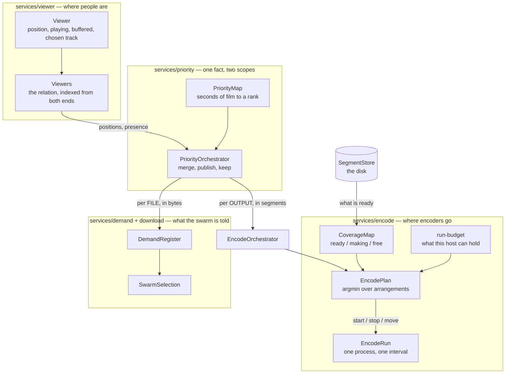

# Encode architecture — who decides where encoders go

One question, one answer, and the answer is arithmetic.

> Viewers are always independent and always reuse what can be reused. The
> number of encoders is however many are needed; how many are needed follows
> from which sets of output parameters are wanted and where the viewers stand
> inside each. Segments produced by ANY encoder are available to ANY viewer, and
> which viewer asked never enters the question.

## The one authority

`services/encode/EncodePlan.js` decides. Nothing else places an encoder,
nothing else takes one away for scheduling reasons, and there is exactly one
call to `#startEncodeRun` in the whole proxy — the one the plan asks through.

It decides from four things and no others:

| what | where it comes from |
|---|---|
| what is already made | the segment store, asked afresh before every decision |
| what is being made | the coverage map's live claims |
| what is wanted | the priority map of that output |
| how many the machine can hold | `run-budget.js`, from measurements of this host |

**No viewer reaches it.** `services/encode/` and
`services/orchestrators/EncodeOrchestrator.js` do not import the viewer layer,
name a consumer id, or hold a person. What crosses is a priority map: zones of
segment numbers with a rank and a real time, and nobody's name on it.

## Viewers become a map, and that is the whole crossing



## Two scopes of one map, and both are right

The map is built from where the viewers are, once, and read at two scopes.

**Per FILE, for the swarm.** The picture, a quality step and a soundtrack of one
film read the same bytes, so every viewer of any of them wants that file's
bytes. This is what `PriorityOrchestrator.mapFor(sourceKey, fileIndex)`
answers, and what is published to the download layer.

**Per OUTPUT, for the encoders.** A person watching 480p wants nothing of the
1080p output at all. This is `mapForOutput(address)`.

One map for both was the second authority over encoders. Handed the film's map,
the plan wanted an encoder on every output of the film; what actually stopped
the ones nobody was watching was the session manager killing them by its own
judgement — and since a viewer moving between steps announces itself, the plan
started them again on the very next pass. Two parties answering "should this
encoder exist" by different rules, several times a second.

An output nobody is on gets a map with **nothing in it**, which is a statement
and not an absence: the walk writes one for every output a session exists for,
including the ones everybody has left. That is how the plan is told to stop what
is on it.

## Which output a person is consuming

A person holds a record on more outputs than they are consuming. The picture is
where their record lives — the browser addresses it, their chosen soundtrack is
written on it, their position is read from it — so they are never let go of it;
but the moment they step down to 480p, the 1080p output is producing for nobody.

That distinction is answered where the two facts meet, and neither layer is
handed the other:

- **which step is on their screen** is a fact about a PERSON, read off the
  viewer as one field;
- **which output a step supersedes** is a fact about the FILM'S SHAPE, answered
  by `LiveOutputs.supersededBy(session, stepOnScreen)`, which takes a plain id
  and has never seen a viewer.

A step, a soundtrack, and a step being warmed are consumed by whoever is
registered on them — everywhere but the picture, a person who stops watching is
let go of, so being known to an output is consuming it. Through a warm-up both
the step on screen and the step being made ready are genuinely produced, which
is the price of the switch not being visible.

## What each of the eight other places used to do

Before 2026-09-08 the plan was one opinion among nine. Each of these placed or
killed encoders by a rule of its own; each now states the fact it knows.

| it knows | it used to do | it now says |
|---|---|---|
| a session was created | start a run at the viewer's position, worked out again | the viewer is placed; the plan reads that |
| a viewer joined further in | start a run there if nothing was being made | as above |
| a step or soundtrack is being warmed | point that session at the switch and start it | this person is at N seconds on it |
| a step was switched to | stop the one left, point the new one | this person is on this step now |
| a step or track was abandoned | stop its encoder | this person has left that output |
| the hardware encoder failed | start a run at the dead one's start | what this host encodes with has changed |
| the input came back | start a run at the last requested segment | decide again |
| the cut table was corrected | restart the members at the measured instant | this run is producing in the wrong place; the instant is in the file's table |
| the bitrate cap changed | restart at where the encoder had got to | this run's arguments are stale |

A **seek** is not in that list because it was already reduced to one thing: it
puts the viewer where they are. The settle timer behind it, its cooldown and its
one-segment backoff are gone — a second debounce on a signal the browser had
already debounced, and every millisecond of it was dead time in front of the
viewer.

## Whether the map is being served in its own order

The zones say what matters most. What the viewer actually waited for is measured
where a viewer measurably waits — the one place in the proxy that holds a
request for a named segment — and recorded against the rank the map gave that
segment **at the moment it was asked for**. It reaches the `encode:` state line
as `served[...]`:

```
served[now 42 wait(s) median 180ms worst 1900ms, soon 6 wait(s) median 90ms worst 240ms, later none]
```

Read it like this:

| what it says | what is wrong |
|---|---|
| long waits at `now` | the urgent zone is not being served first — a fault in whoever acts on the map |
| long waits at `soon`/`later`, none at `now` | the zones are the wrong width: the urgent one too narrow, so the viewer reaches material only ranked "soon" |
| `now none` while the viewer is watching | nothing was ever urgent — the map is not reaching this output |
| a band reading `none` | silence, not a zero, and it is printed as `none` so it cannot be read as "no waits, all good" |

Ranks are collapsed into three bands because the map's own scale is as long as
the film needs — a hundred ranks on a long file — and a hundred-row table says
nothing a reader can hold. The width of `soon` is a tenth of the top rank, which
is the map's own shape (its zones widen geometrically) rather than a threshold
chosen for the table.

The download half is measured the same way and on the same scale, so the two are
comparable: `download-architecture.md`.

## What is checked

`test/one-authority.test.js` holds the shape: one caller of `#startEncodeRun`,
no encoder stopped for being unwatched, the settle machinery absent, each output
reading its own map, and the soundtrack's start instant read off the table
rather than handed in.

`test/priority-map-per-output.test.js` holds the two scopes, over the real
viewer registry, the real `LiveOutputs` and the real `PriorityOrchestrator`.

`test/encode-plan.test.js` holds the arithmetic, including that every encoder
stops when nobody is watching the output.
