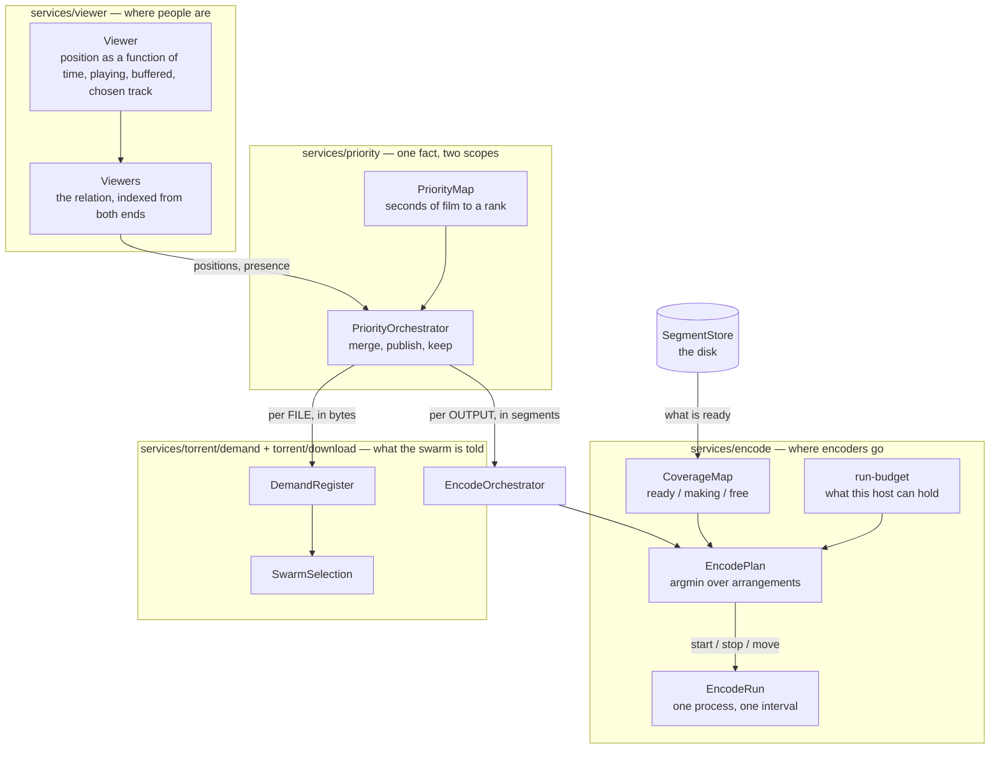

# Encode architecture — who decides where encoders go

One question, one answer, and the answer is arithmetic.

> Viewers are always independent and always reuse what can be reused. The
> number of encoders is however many are needed; how many are needed follows
> from which sets of output parameters are wanted and where the viewers stand
> inside each. Segments produced by ANY encoder are available to ANY viewer, and
> which viewer asked never enters the question.

## The one authority

`services/encode/EncodePlan.js` decides. Nothing else places an encoder,
nothing else takes one away for scheduling reasons, and there is exactly one
call to `#startEncodeRun` in the whole proxy — the one the plan asks through.

It decides from four things and no others:

| what | where it comes from |
|---|---|
| what is already made | the segment store, asked afresh before every decision |
| what is being made | the coverage map's live claims |
| what is wanted | the priority map of that output |
| how many the machine can hold | `run-budget.js`, from measurements of this host |

**No viewer reaches the decision.** `EncodePlan` and `EncodeOrchestrator` do not
import the viewer layer, name a consumer id or hold a person. What crosses is a
priority map: zones of segment numbers with a rank and a real time, and nobody's
name on it.

**The rest of `services/encode/` names people, and holds none.** A step and a
soundtrack are chosen, warmed and left per person, so `Renditions`,
`QualityController` and `CushionReport` say WHOSE — by consumer id, which is a
name and not an object. What they may ask about that name and what they may
tell the viewer layer about it is `services/viewer/choices.js`: the mode a size
was picked in, what a link measured, the soundtrack chosen, the step on screen,
what is being warmed, who is present, and the standing quality ask. Values in,
values out. No `Viewer` crosses the boundary and nothing outside the viewer
layer writes a viewer's record — which is the rule a position cost 77 encoder
starts for breaking (field 2026-09-13).

This paragraph used to claim the whole directory named nobody, which was never
true of `Renditions` and could not be: which soundtrack to make is a fact about
a person. What matters is that it is a NAME, so the viewer's record stays in
one place with one writer.

**What answered a request is the viewer's, per viewing** (roadmap item 97,
step 9). The page stamps every request with the GENERATION of its viewing — a
number it raises on the viewer's own seek, before it sends anything — and the
proxy reads it rather than counting one, so a request made before a seek and
delivered after it still says which viewing it belongs to. Three things follow,
and each is asked through `choices.js`, by name:

1. every file route asks FIRST whether that viewer still takes requests of that
   generation, before a step or a soundtrack is resolved — resolving can create
   an output and registers the viewer on it, which a request of a viewing
   already left must not do;
2. a repeat of a request within one viewing is answered by the output that
   answered it: the step route records the height asked for and the segment
   (the init as −1), the picture's own route records under the height that
   output is named after. A soundtrack records nothing of this kind;
3. a response holds its output from its first byte to its end, and no output is
   disposed while an assignment holds it — except on a hardware encoder's
   failure, where nothing can go on making what it made. The idle expiry asks
   only the assignments, not whether anybody is registered, so a paused
   viewer's claim on an output stays a separate decision.

**Which output serves a viewer is one rule, asked by every path, and the
choice is the viewer's own** (step 11). A request for a piece is answered, in
order, by what already answered that address in this viewing (`given`), by the
output chosen for this viewer at that height (`chosen`), and only then by the
rule — and a repeat whose output has gone is served from its stored piece or by
an output with a proven-compatible header, or answered `assignment-lost`. The
rule (`serving-output.js`, `outputSuits`) asks the picture's material, the size
a viewer who picked by hand requires, and what the viewer's OWN link does with
the output's whole load: the picture and the soundtrack they chose, each part
`known` (a limit), `estimated` (a stated average) or `unknown` (no bound), the
load as trustworthy as its worst part (`link-budget.js`). `unknown` is refused
against a measured link; `estimated` is admitted by estimate and reported to
the page as not confirmed; a bound is taken before an average. When nothing
suits, nothing is handed over: the answer is `output-unavailable`, with the
figures, and the page explains it. The shared `OutputCatalog.servedBy` record
and the worst link over all viewers are gone; the quality budget asks each
viewer's link for that viewer alone.

**A bitrate limit is part of an output, not a figure moved under it** (step
10). A software encode's `-maxrate`/`-bufsize` are named by its key
(`vbv=<maxrate>k-<bufsize>k@<level>`), so two limits are two outputs and a
slow viewer's limit can no longer land on every viewer of a picture — which is
what it did while it was a field of the output set by the worst of their links.
The level is pinned (`-level:v`) to the level of the NOMINAL output of that
size and frame rate, so every limit at one size writes the same header
and a viewer can be moved between them under the address they already play.
A limit above the nominal one is refused. Hardware encoders are given no limit
and state none (`vbv=-`). Whether the pinned level is the one x264 would choose
for the nominal output is checked before a release
(`stand/segment-compat/level-check.mjs`).

**Which limits a frame has is decided by its AREA** (step 14, decided with the
user 2026-09-24). The rows of limits are the ladder's frames at 16:9, sized by
the same function that sizes an encode; a frame takes the row nearest by the
ratio of areas, the larger row on the exact border, and a row with no nominal
of its own borrows the nearest row that has one (`limitRowFor`,
`nominalKbpsFor`). Every place that picks a row — opening an output, the move
between limits, the offer's price of a step and the link rule — is handed the
whole frame, so all of them name the same row. By height alone a 1920x800 film
fell in the 720 row although it is nearer the 1080 one. The proposed measured
table of lower limits was dropped on 2026-09-27. Step 14 now qualifies this
machine's encoder modes and does not set lower bitrate limits.

## Where a viewer is, and how it reaches the encoders

A viewer's position has ONE writer — the viewer — and is a function of time:

```
position(now) = stated + (playing ? 1 : 0) × (now − statedAt)
```

A viewer whose picture moves covers a second of film every second, so between
the moments they speak their position is known exactly; one whose picture is
stopped covers nothing. Nothing else writes it, and in particular a request for
a segment does not: a request says the viewer is still here, and the segment
either exists and is served or does not and is waited for.

Held as a stored number instead it was a staircase, flat for the ten seconds
between reports and then a jump — and with two writers filling it in turn the
steps went backwards as often as forwards. Field 2026-09-13, one output over one
second: `p100:#9..#10`, `p100:#18..#20`, `p100:#16..#18`, `p100:#18..#20`, while
the second viewer sat frozen at 1673.6 s. The placement follows the map, so the
machine spent six minutes on 77 encoder starts and 141 stops.

PRESENCE IS A SEPARATE FACT and it is the connection: a viewer is here until
something says otherwise. Silence never says it — a pause, a hidden tab whose
timers are throttled, and a full cushion are all silent and all still watching.

## Viewers become a map, and that is the whole crossing


```mermaid
flowchart TB
  subgraph V["services/viewer — where people are"]
    VW[Viewer<br/>position as a function of time, playing, buffered, chosen track]
    VS[Viewers<br/>the relation, indexed from both ends]
  end

  subgraph P["services/priority — one fact, two scopes"]
    PM[PriorityMap<br/>seconds of film to a rank]
    PO[PriorityOrchestrator<br/>merge, publish, keep]
  end

  subgraph E["services/encode — where encoders go"]
    CM[CoverageMap<br/>ready / making / free]
    EP[EncodePlan<br/>argmin over arrangements]
    RB[run-budget<br/>what this host can hold]
    ER[EncodeRun<br/>one process, one interval]
  end

  subgraph D["services/torrent/demand + torrent/download — what the swarm is told"]
    DR[DemandRegister]
    SS[SwarmSelection]
  end

  VW --> VS
  VS -->|"positions, presence"| PO
  PM --> PO
  PO -->|"per FILE, in bytes"| DR
  DR --> SS
  PO -->|"per OUTPUT, in segments"| EO[EncodeOrchestrator]
  EO --> EP
  CM --> EP
  RB --> EP
  EP -->|"start / stop / move"| ER
  ST[(SegmentStore<br/>the disk)] -->|"what is ready"| CM
```

## Two scopes of one map, and both are right

The map is built from where the viewers are, once, and read at two scopes.

**Per FILE, for the swarm.** The picture, a quality step and a soundtrack of one
film read the same bytes, so every viewer of any of them wants that file's
bytes. This is what `PriorityOrchestrator.mapFor(sourceKey, fileIndex)`
answers, and what is published to the download layer.

**Per OUTPUT, for the encoders.** A person watching 480p wants nothing of the
1080p output at all. This is `mapForOutput(address)`.

One map for both was the second authority over encoders. Handed the film's map,
the plan wanted an encoder on every output of the film; what actually stopped
the ones nobody was watching was the session manager killing them by its own
judgement — and since a viewer moving between steps announces itself, the plan
started them again on the very next pass. Two parties answering "should this
encoder exist" by different rules, several times a second.

An output nobody is on gets a map with **nothing in it**, which is a statement
and not an absence: the walk writes one for every output a session exists for,
including the ones everybody has left. That is how the plan is told to stop what
is on it.

## Which output a person is consuming

A person holds a record on more outputs than they are consuming. The picture is
where their record lives — the browser addresses it, their chosen soundtrack is
written on it, their position is read from it — so they are never let go of it;
but the moment they step down to 480p, the 1080p output is producing for nobody.

That distinction is answered where the two facts meet, and neither layer is
handed the other:

- **which step is on their screen** is a fact about a PERSON, read off the
  viewer as one field. The page STATES it (`playingHeight` on the viewer's
  report, sent the moment hls.js has switched), and `Renditions.viewerPlays`
  records it. It used to be inferred from the first segment requested of a
  rung, which is the player fetching rather than the picture having moved;
- **which output a step supersedes** is a fact about the FILM'S SHAPE, answered
  by `OutputCatalog.supersededBy(session, stepOnScreen)`, which takes a plain id
  and has never seen a viewer.

A step, a soundtrack, and a step being warmed are consumed by whoever is
registered on them — everywhere but the picture, a person who stops watching is
let go of, so being known to an output is consuming it. Whether an output is
wanted at all is asked of the viewer registry and nothing else: an output a
picture made on its own behalf once carried a made-up "family" claim that kept
it alive, which was a second answer to the same question and is gone. Every
viewer has a name; a request that names nobody makes no viewer. Through a warm-up both
the step on screen and the step being made ready are genuinely produced, which
is the price of the switch not being visible.

## A move between two limits of one height

A bitrate limit is part of an output, so a viewer whose link cannot carry the
limit on their screen is given ANOTHER output of the same height at a lower
limit — for them alone, and without their player being told (roadmap item 97,
step 12). The address `v/<height>/…` does not change; what changes is which
output this side answers it with.

1. **Prepared, not switched.** `Renditions.prepareSameHeightSwitch` opens (or
   finds, by its key) the output of the same size at the next limit of
   `limitsFor(height)` that the viewer's link admits, marks it a step of the
   picture, and registers the viewer on it — that is what buys it an encoder.
   The choice (`Assignments.choose`) is not touched: until the move is made they
   are given what they were given. The move being prepared is a field of the
   viewer, `Viewer.sameHeightSwitch`, and not `warmingVariantId`, which is a
   step their player will switch to itself.
2. **Made on the store's own event.** `SegmentStore.onPublished` is filtered by
   the prepared output's key. The move is made when the segment the viewer will
   ask for NEXT is closed on it: one past the highest they were given in the
   viewing they are in now, or — with nothing given in it, straight after a
   seek — the one where they stand. It is read at the moment of the event, so a
   segment closed behind that one, or an event that arrives after a seek, moves
   nothing.
3. **One synchronous stretch.** The choice under each height it was chosen
   under, the verdict, the step on screen, the registration on the new output
   and off the old one change with no `await` between them.
4. **The output left is not disposed.** The picture is never left. A step that
   is left loses the viewer, the plan stops its encoder by its empty map, and the
   idle expiry removes it once no assignment holds it; a repeat of an address it
   answered is still answered by it, because `given` is read before `chosen`.
5. **Cancelled when not wanted.** When the link carries the output on screen
   again, when the prepared output no longer suits, when the player moves to
   another rung, when encoding the prepared output has failed for good, or when
   nothing of the film is left to give from it: the viewer stops watching the
   prepared output and nothing else changes for anybody.
6. **Asked again on three events, never on a timer.** A segment closed on the
   prepared output (`SegmentStore.onPublished`); the viewer's own report
   (`Renditions.noteViewerReported`, from the net-report route), which is what
   carries a change of their link; and encoding the prepared output failing for
   good (`Renditions.noteProductionFailed`, told by `EncodeRuns`). Without the
   last two, a move onto an output that closes nothing stood for ever, and the
   quality budget — which leaves a viewer with a move pending alone — never
   decided for them again. Each event may also make the move, on the same one
   condition: the segment they will ask for next is closed. A move is not
   prepared onto an output whose encoding has failed. The fourth way a move can
   wait — no encoder placed on the output — does not arise until the admission
   of step 13 can refuse, and that refusal will be its event.

The quality budget uses this lever first, in both directions: down to the
highest lower limit the link admits, up one limit at a time, and another height
only where the height on screen has no limit left to move to. A copy has no
limit and a hardware encode is given none, so for them the lever is still the
height. The measured table of lower bitrate limits was dropped on 2026-09-27;
the product currently supplies only the nominal limit through `limitsFor`.
Per-machine calibration (step 14) qualifies encoder modes and does not create
lower bitrate limits, so same-height bitrate moves have no target in the current
product configuration.

7. **A move up waits for the cushion; a move down does not** (roadmap item
   98). Once the piece asked for next is closed, a move UP is made only when
   the viewer holds the cushion this file needs (`minimumBufferSeconds`), and
   their next report asks again until they do. A move DOWN was started because
   their buffer would run dry, so it is made the moment the piece is ready.

## When the quality budget moves a viewer (roadmap item 98)

The page has no quality control: the quality is always automatic. What moves a
viewer is decided here, per viewer, and each part of it is a measurement.

1. **Judged on the viewer's report, not on a timer.** `QualityController.noteViewerReported`
   runs from the net-report route, for the step down, the picture they see and
   the step up alike. The chosen fifteen-second window of a slow link or a slow
   machine, the 0.95x threshold of slowness, the sixty-second window before a
   step back up, the ten-second buffer threshold, the thirty-second wait after
   every action and the 80 % share of the link are gone. The five-second timer
   only samples the host's load and the torrents' download rates; an encoder's
   price is learned when it closes a piece.
2. **Down when the buffer would run dry first, for a reason a smaller output
   removes.** On the buffer's trend it ends sooner than another output could
   close the piece they need, counting the time until their next report
   (`quality/drain-threat.js`), AND either their link carries less than the
   stream they are given, or this machine makes the picture slower than
   realtime over its run's own working time (`encode/RunClock.js`: the time its
   input waited for the swarm and the time it was stopped are taken out). A
   threat neither explains — the swarm is short — is not answered with a
   smaller picture, which reads the same input. The trend is a least-squares fit
   over the shortest run of their reports spanning one segment
   (`viewer/buffer-trend.js`), because the buffer rises a segment at a time and
   two readings catch only the rise or the fall. The time to readiness is the
   observed preparation time of another output of this mode, else this host's
   measured first-segment time. The levers: for the link, a lower limit of the
   same height, then a lower height; for the machine, a lower height. A lower
   height is asked of the player as URGENT — their page switches as soon as the
   rung is ready, without waiting for a cushion. Where nothing can be prepared
   they stay on what they are given, with no message.
3. **The picture the viewer sees bounds a re-encode.** The page sends the
   frame it would show without enlarging, in physical pixels; it is kept on
   `Viewer.visiblePicture`. The bound is the smallest rung of the source's
   ladder whose frame is not smaller (`quality/visible-rung.js`). It sets the
   box an output is opened at (`OutputOpening`), the ceiling of every step up,
   and the rung a step down prefers. A copy of the source is never re-encoded
   for being taller than that.
4. **A smaller picture moves the viewer only onto a READY rung**
   (`Renditions.heightReadyFor`: the piece they ask for next closed on it);
   with none ready, the next judgement of their link or of the machine applies
   the bound.
5. **Up one rung when there is room, every term measured**: the picture on
   their screen is made at least at realtime over its run's own working time (a
   copy is not limited by an encoder), their buffer is not draining and holds
   at least the time another output takes to be ready, their link carries the
   next height, and the picture they see is not already served. A rung this
   host has been measured failing at is not offered, so the step back up cannot
   return to it; no window has to pass.
6. **A request stands for as long as its conditions hold**: each judgement
   of the viewer's report asks for what it needs again, and a request it does
   not repeat is let go — a draining buffer for a step up, a buffer that no
   longer drains for a step down, no room for the output, a picture that is no
   longer smaller. No chosen time ends a request. The page drops the move it
   was preparing when the proxy stops asking for it.
7. **The page switches a variant when the rung is ready**, and for a request
   that is not urgent only once it holds `minimumBufferSeconds`.

## A place on the machine

How many encoders ONE output may run is answered per output
(`EncodeRuns.maxRunsForOutput`) and is always at least one. What refuses the
encoder that would slow everybody is `EncodeAdmission`, across every output at
once (roadmap item 97, step 13).

1. **The unit is seconds of work per second of film**, the one the quality
   offer judges steps in (`EncodeCost.loadOfOutput`). Costs add, and a set of
   encoders is affordable when the machine, corrected for the share of it
   nobody has priced, still makes a second of film per second. A soundtrack is
   a small fraction of a picture; counting processes would refuse a viewer
   their sound. On the addon host the sum reproduces the measurement: two 1080p
   encodes at 1.96x alone cost 1.02 s/s and make 0.98x, measured 0.99x and
   0.98x.
2. **A place is held by an OUTPUT**: by every live encoder at its output's
   cost, and by every output a present viewer is being prepared onto — a step
   being warmed or a move to another limit — once however many wait for it.
   The second is read off the viewers' own records (`Viewers.outputsBeingPrepared`),
   so a place ends with its record on whichever path that record is cleared,
   and there is no register of its own to keep in step.
3. **Asked before a preparation is recorded**, in the same synchronous stretch
   as the record: two preparations onto two different outputs with room for
   one cannot both be admitted, because the second is asked after the first is
   written. Refused, a move answers `noPlace` and the budget goes to a lower
   height (never a higher one); a warm-up answers `output-unavailable`.
4. **The plan is bounded by it** (`EncodeOrchestrator.#withinMachine`): an
   output may run no more encoders than still fit, and a new one on a full
   machine gets none until one elsewhere ends.
5. **An admitted encoder is never taken away**, and a place promised to a
   preparation is kept: the machine's answer is never below what already runs
   on an output, nor below one for an output a preparation holds.

Not solved: places go to whoever asks first, so a second encoder catching up on
one output can hold the place a viewer opening another film waits for.

## What each of the eight other places used to do

Before 2026-09-08 the plan was one opinion among nine. Each of these placed or
killed encoders by a rule of its own; each now states the fact it knows.

| it knows | it used to do | it now says |
|---|---|---|
| a session was created | start a run at the viewer's position, worked out again | the viewer is placed; the plan reads that |
| a viewer joined further in | start a run there if nothing was being made | as above |
| a step or soundtrack is being warmed | point that session at the switch and start it | this person is at N seconds on it |
| a step was switched to | stop the one left, point the new one | this person is on this step now |
| a step or track was abandoned | stop its encoder | this person has left that output |
| the hardware encoder failed | start a run at the dead one's start | what this host encodes with has changed |
| the input came back | start a run at the last requested segment | decide again |
| the cut table was corrected | restart the members at the measured instant | this run is producing in the wrong place; the instant is in the file's table |
| the bitrate cap changed | restart at where the encoder had got to | nothing: a limit is part of an output since 2.87.0, so another limit is another output and no running encoder is ever told a new one |

A **seek** is not in that list because it was already reduced to one thing: it
puts the viewer where they are. The settle timer behind it, its cooldown and its
one-segment backoff are gone — a second debounce on a signal the browser had
already debounced, and every millisecond of it was dead time in front of the
viewer.

## Whether the map is being served in its own order

The zones say what matters most. What the viewer actually waited for is measured
where a viewer measurably waits — the one place in the proxy that holds a
request for a named segment — and recorded against the rank the map gave that
segment **at the moment it was asked for**. It reaches the `encode:` state line
as `served[...]`:

```
served[now 42 wait(s) median 180ms worst 1900ms, soon 6 wait(s) median 90ms worst 240ms, later none]
```

Read it like this:

| what it says | what is wrong |
|---|---|
| long waits at `now` | the urgent zone is not being served first — a fault in whoever acts on the map |
| long waits at `soon`/`later`, none at `now` | the zones are the wrong width: the urgent one too narrow, so the viewer reaches material only ranked "soon" |
| `now none` while the viewer is watching | nothing was ever urgent — the map is not reaching this output |
| a band reading `none` | silence, not a zero, and it is printed as `none` so it cannot be read as "no waits, all good" |

Ranks are collapsed into three bands because the map's own scale is as long as
the film needs — a hundred ranks on a long file — and a hundred-row table says
nothing a reader can hold. The width of `soon` is a tenth of the top rank, which
is the map's own shape (its zones widen geometrically) rather than a threshold
chosen for the table.

The download half is measured the same way and on the same scale, so the two are
comparable: `download-architecture.md`.

## What the master playlist declares, and why it is not cosmetic

`BANDWIDTH` and `AVERAGE-BANDWIDTH` per variant, both measured
(`services/encode/output/rates.js`):

- the average is the file's own length over its duration, exact and known when
  the session is created;
- the peak is the biggest piece produced over the span it covers, and equals the
  average until a piece exists — a ratio invented meanwhile would be the
  fabrication this replaced;
- a re-encoded height is declared at the cap we impose, which is exact;
- a smaller height at the pixel share of the source's rate, which errs high, and
  high is the safe direction.

It used to be `height * height * 3.2`. **The browser sizes its cushion in BYTES
from `BANDWIDTH`**, so a figure five times low makes the cushion five times
shallow: field 2026-09-08, 3.73 Mbit/s declared for a file carrying 18.4, 120 s
asked bought 56 MB — 26 s of that film — and the deepest the browser ever held
was 17.1 s. Inflating it is not the answer either: hls.js compares it against
its own estimate of the link to decide a level is unplayable, and its recovery
then moves level by itself, which does not honour our pinning.

## The objective is the map's own rank order

Not three terms in seconds. One pair per rank the map states, most urgent rank
first, compared position by position:

```
[ late(100), done(100), late(99), done(99), … late(1), done(1) ], encoders, wasted
```

`late(r)` is how long anybody waits past a deadline at rank `r`; `done(r)` is
when the last number of that rank is made. A difference at a higher rank settles
it and nothing lower can reopen it — which is the stated order: nobody stares at
a spinner; then the film in front is encoded as fast as it can be, band by band
as the map ranks them; then, with what is left over and only then, the film
behind, in case somebody seeks back.

**No weights, and none possible.** A weight would let seconds at one rank buy
seconds at another, and it would be a figure nobody measured. The map is the
source of truth about what matters and it already says so — ten ranks on a film,
p100 at the number a viewer is stopped on, doubling zones down to p91 for the far
tail, p1 for what lies behind them.

`encoders` ranks below every rank of the map, so spare capacity cannot buy an
encoder where the map is indifferent. `wasted` is the swarm's bill for anything
fetched twice.

## Why an encoder is not moved for nothing, and it is not a rule

There is no threshold here, and there must not be one. What kept an encoder
moving was three quantities computed wrongly, not a policy that needed tuning.

**`delaySec` is when a body finishes the piece it STANDS ON.** For a run that has
produced something, one piece at the rate in force; for one still warming up, the
measured time to a first piece less the time it has already been alive. The
arrival of anything further on is that plus the pieces between, and nothing else.

It used to be `delay + (index - at + 1) / rate`, which charges every body a whole
piece for the one it is already making. That is right for a body that does not
exist yet and wrong for a run 0.8 s into a 0.9 s piece — and the difference is
the whole fault: from #58, reaching #59 was priced at 1.89 s against 1.88 s for a
kill and a cold start, a coin flip lost by ten milliseconds. Priced correctly it
is 1.08 s against 1.88 s.

**One rate, the one the arrangement puts in force.** Concurrent encoders slow
each other, measured on this host, so a piece costs what it costs at the body
count the arrangement has. Taken from the unpenalised rate while arrivals used
the penalised one, an extra body looked cheaper than it is and the plan bought a
second encoder where one served.

**Each body states its own debt** where it is created, as a function of what one
piece costs — because only there is it known what the body IS, and at the point
of pricing only how many there are. So there is no kind, no tag and no case
analysis.

**The measured start is separated from the piece it contains**, because the two
scale differently: a piece costs more when encoders share the machine, a spawn
does not.

```
spawn overhead  = measured first output - what one piece costs alone
a fresh encoder = spawn overhead + the piece at the rate in force
a moved one     = the kill, and then the same
```

**Both figures are measured before any viewer exists**, and until 2026-09-10
neither was. They were learned only from runs that had ENDED, so at a cold open
both read zero — and zero does not mean "unknown" here, it means "free".

That is not a small bias, it is the whole comparison. Subtract keeping from
moving and what is left is exactly the killing plus the time the run has already
lived:

```
keep a warming run  = firstByteWait - elapsed
move it             = kill + spawn overhead + one piece
                    = kill + firstByteWait                (spawn overhead = firstByteWait - one piece)
move - keep         = kill + elapsed
```

`elapsed` is the warm-up a move throws away — a process started, an input
opened, the first bytes fetched, a decoder filled — and it is the term that
makes moving cost something. Set `firstByteWait` to zero and it cancels out of
both sides along with the kill: keeping and moving then cost the same figure to
the millisecond, the tie falls to position, and any advantage however small wins.

Field 2026-09-08, the first fifteen seconds of a session: start at #68, a second
later kill and start at #69, half a second later kill and start at #68 again,
each dying having produced nothing. Over two days 153 runs were stopped by the
plan and 68 of them made no segment at all, median life 9.6 s.

`services/encode/start-stop-cost.js` measures both from **one ffmpeg run at
startup**: spawn to the first piece the encoder itself announces closed, then
SIGTERM to exit. 0.68 s and 0.02 s on the developer's desktop. `RunCosts` starts
from those and replaces them with readings from real runs as they arrive.

There was an `Infinity` here once for the cost of a move, on the reasoning that
an unmeasured price must not license an irreversible act. It was removed as an
exception in a model that needs none — correctly, but what replaced it was a
floor of zero, which licenses the act rather than forbidding it. A measurement
is what a model like this needs, not an exception and not a floor.

And a run killed before producing anything is a measurement too — a lower bound
on the first output, and the only reading a thrash can supply, since every run in
one is killed before it finishes anything. So a thrash makes its own moves
progressively dearer until it stops.

### What that was for

Field 2026-09-08: 39 moves in one session, 24 of them between three adjacent
numbers about 0.8 s apart. One viewer on a host affording three runs got three.
The picture stood still for 116.7 s in three interruptions, the worst 91.8 s.

Compounding it, the map states `withinSeconds: null` for the film behind the
viewers — nobody is waiting there — and `deadlineReaderFor` read that through
`Number()`, where `null` is 0. So the film a viewer had already passed was due
IMMEDIATELY and was the most urgent material in the file: it bought encoders, and
it took the run standing in front of the viewer because that run was the nearest
body to it.

Checked by simulation over eighty ticks against the map's real shape — ten zones
doubling ahead of the viewer, one behind — at both one and three runs: the
encoder is placed once, left alone, and moved exactly once, at the viewer's own
seek.

## Where a second encoder joins a stretch

Derived, not halved. A stretch of unmade film runs from `from` to `to`; whoever
is already on it stands at `from` and owes `w` before the piece under it exists;
a fresh one placed at `x` owes `d` — its start and then a whole piece — and both
then work at the rate two encoders leave each other, which is measured here.

```
the one already there closes [from, x-1]:   w + (x - 1 - from) / r      rises with x
the fresh one closes         [x, to]:       d + (to - x)     / r        falls with x

x* = (from + to + 1) / 2  +  (d - w) * r / 2
```

The midpoint, shifted forward by half the difference of what the two owe, in
pieces. Halving is the special case `d = w`, which holds when both are fresh.

**The shift is under one segment in every measured configuration** — 0.24 of a
piece at the addon host's 1080p contention — so halving was very nearly right,
and saying otherwise would be dressing it up.

What the derivation adds is the question halving never asked: **is a second
encoder worth having at all?**

```
one:  w + (to - from - 1) / rate
two:  w + (x* - 1 - from) / r
```

Nothing is proposed where the second does not win. At 1920x1080 the measured
penalty for a second encoder on the addon host is 1.98 — it takes very nearly
all of the first's speed — and the objective keeps one; where a second is free it
places three.

## What the log says when anything is placed or taken away

```
encode-plan on <output>: start #58..#481, stop #?..#?
  [speed=4.45x firstByte=1.26s kill=0.04s refetch=0.000s/s maxRuns=2 live=1]
```

Every action with its INTERVAL, which is what a run is, and then every term the
decision was made from. Printed on any pass that does something — a session
where nothing changes says nothing.

The terms are there because an interval says WHAT was decided and only these say
WHY. A decision of this plan is

    delay + (index - at) / rate + madeBetween * refetch    against a deadline

so a recorded decision without the rate can be re-read and not recomputed. That
is not hypothetical: the one-piece intervals of 2026-09-08 were diagnosed by
substituting the rate from the speeds the session reported elsewhere — six
different figures, none of which reproduced the answer the plan had given.

A zero in `firstByte`, `kill` or `refetch` is a measurement nobody has taken, not
a free operation. It is printed so that reading it as free is a choice.

**`speed` has one owner: the run.** `EncodeRun.speedX` is the film a run made
between two closed pieces over its own working time (`encode/RunClock.js`), so
the time its input waited for the swarm and the time it was stopped are not in
it. The run announces each reading once (`onSpeedMeasured`); `EncodeCost` learns
the price of the output from it, the quality budget and the playback forecast
read the newest reading of the output's runs, and the plan reads the runs
themselves. Before a run has closed two pieces, and after a restart, the plan
uses `startingSpeedFor`: what this output was last measured doing alone, or
what the startup measurements predict. Nothing keeps a copy across restarts,
and ffmpeg's cumulative `speed=` is read by nothing: it divides by every second
the encoder was stopped or starved.

What the swarm delivers is not in this figure, by construction. It is the
separate supply term `refetch`, and while that is unmeasured (printed as zero)
the plan's arrivals assume the input keeps up.

It was missing, and its absence cost three wrong diagnoses of one field session.
The line printed the windows, the budget and where the live runs stood; the
intervals the actions carried were the one thing it did not print. What that
session actually did was give every encoder an interval of exactly ONE segment —
63 runs, each spending 1.26 s reaching its first piece, making that one piece,
reaching the end of its interval and exiting, twelve of them normally. The
reasons printed beside them read as moves back and forth, so the fault was read
as an oscillating placement three times over. An interval of one segment turns
the protection against two encoders writing one name into a mill for processes.

## What proves a segment is finished

Its NAME, and there is nothing else. A piece being written is called
`making-<from>-00042.mp4` — the tag is the first number of the stretch its run
was given — and it takes `segment-00042.mp4` when the encoder says it has closed
it, which it does on a channel of its own (`-segment_list pipe:3`). Making it
servable is therefore one rename inside one directory, performed by the store
because the store owns the disk. A name the encoder reports after it was told
to stop, or after its input ended early, is the piece it had open being flushed
and is never published; every published piece is also shown, from its own
media, to reach its cut (`encode/piece-completeness.js`).

Every output with a grid is cut this way, the even grid of a re-encode
included (`cutsAtGivenTimes` in `encode/output/cut-grid.js`, read by the run
command and by the serving alike). The `hls` muxer, which re-encoded outputs on
the even grid used to take, renames its pieces itself — including the one it
has open when it ends, on our SIGTERM and when its input stops — so a stopped
run left a piece shorter than its span under the served name. Field 2026-09-27
shows what that costs after a backward seek: piece #111 held 0.37 s of its
4.2 s, the browser appended it, counted the fragment as loaded and never asked
for that stretch again. Only a run given no cut list still takes the `hls`
muxer, and at startup the pieces that muxer named in an earlier life of the
process are removed rather than adopted.

Four things follow, and each replaced a guess:

1. **a request can never reach a half-written piece.** Closure used to be
   inferred from the NEXT number existing — sound for one writer walking forward,
   false the moment two runs share an output, which is what the plan gives an
   output whenever it places a second encoder. Field 2026-09-08:
   `segment-00057.mp4` served at 2 268 361 bytes and then at 4 510 940, exactly
   half; the browser appended the half and refused the whole for the rest of the
   session, with the picture frozen at 319.66 s;
2. **the last piece of a run is provable.** Under the successor rule nothing
   followed it, so it never was — the resume case that held one segment for 46 s
   and then answered 404;
3. **clearing up after a dead run is a name match.** Its unfinished pieces are
   the ones carrying its own tag: no stretch to search, no bytes to judge, and no
   way to remove a complete piece somebody else closed. `services/encode/
   open-piece.js` did all three of those by guessing and is gone, along with the
   session manager's copy of it;
4. **stopping a run never leaves a short piece servable.** The plan stops runs
   whenever the map moves, a backward seek among them, and each stop used to
   be able to leave one.

## How a request for a segment ends

A request steers no encoder. The file is served if the store holds it whole;
otherwise the request waits for the store's own announcement that the segment
was published (`SegmentStore.waitFor`), for the waits of that output to be
invalidated (a viewer left the rung), or for the requester to go. How long it
may wait is the requester's: the page states it (`X-Hold-Ms`, its own deadline
less the round trip it has measured) and the route answers "retry" by then. A
requester that states nothing is held until it closes the connection. There is
no poll and no hold time chosen by the proxy.

Which output a request is answered by is decided in the encoding component
(`encode/OutputOpening.js`), without knowing who asked; the server operation
(`server/ViewerRequests.js`) places the requester on it.

## What is checked

`test/one-authority.test.js` holds the shape: one caller of `#startEncodeRun`,
no encoder stopped for being unwatched, the settle machinery absent, each output
reading its own map, and the soundtrack's start instant read off the table
rather than handed in.

`test/priority-map-per-output.test.js` holds the two scopes, over the real
viewer registry, the real `OutputCatalog` and the real `PriorityOrchestrator`.

`test/encode-plan.test.js` holds the arithmetic, including that every encoder
stops when nobody is watching the output.

`test/segment-store.test.js` holds the naming rule: a piece under its served
name is finished — the last one of a run included — one under a working name is
not and cannot be reached, closing it is one rename, and clearing up after one
run leaves every other run's work alone.

## Per-machine calibration and admission (roadmap item 97, step 14)

At startup, `encode/calibration.js` qualifies every mode the proxy may select,
including the software encoder kept for runtime fallback. Each mode uses the
production arguments on a generated test clip, and every segment must decode
independently. `encode/fingerprint.js` keys the results to the FFmpeg and x264
versions, CPU model and thread count for software, or FFmpeg version, device
model and driver for hardware. A changed key does not reuse measurements from
the previous configuration.

`encode/throughput.js` measures qualified modes at five frame sizes from
256×144 through 3840×2160. Between measured sizes it interpolates and subtracts
the measured interpolation error; it does not offer a size outside the measured
range. Calibration stops measuring slower modes and larger sizes once a faster
mode cannot sustain realtime. If a detected device has no qualified mode, the
proxy uses software encoding.

`encode/LocalObservations.js` stores observations from admitted encodes in the
proxy's `local-observations.json`. It keeps speed without competing encodes,
average and peak segment rates, output preparation time and the viewer buffer at
a transition. A matching fingerprint is required. These observations refine
output cost, the peak estimate of an unbounded hardware encoder and transition
preparation timing; an empty or stale file leaves the base policy in force.

`encode/EncodeAdmission.js` counts running encoders and outputs that viewers are
being placed on or prepared to use. Opening an output checks capacity and
records the viewer in one synchronous call through `OutputOpening` and
`ViewerRequests`; a second simultaneous opening sees the first reservation. If
no measured mode or remaining capacity is available, the proxy answers 409
`no-capacity` before playback. Unknown costs on occupied outputs count as
unknown capacity, not free capacity. The health report exposes safe encoding
headroom, and the pool's file-specific answer uses the same occupied-cost data.
If the opening is refused, the page asks the pool and prepares the file again
through an eligible proxy before showing video. Each refused proxy is excluded
for that opening attempt, so stale pool answers cannot make the page cycle.
