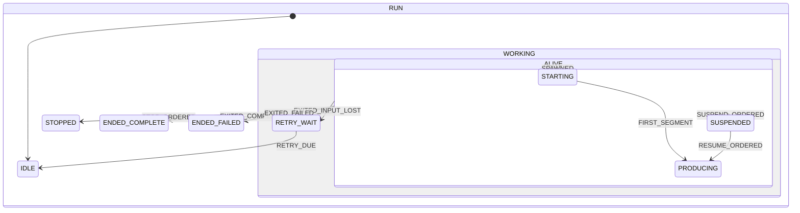

<!-- GENERATED from services/encode/encode-run-state.js by scripts/render-run-graph.js.
     Do not edit by hand: change the table and run `npm run graph`. -->

# The encoder run — states and transitions

One run of one ffmpeg inside one transcode session. The table this is drawn
from is executed by `services/hls-session-manager.js`; every transition a real
run makes is logged as state, event and target, so a run that takes an edge
absent here is a violation the log names.

## States

| state | means |
|---|---|
| `IDLE` | No process, and one is expected — before the first run, or after a retry timer fired. |
| `STARTING` | Spawned; this run has produced nothing servable yet. |
| `PRODUCING` | This run has produced at least one servable segment. |
| `SUSPENDED` | SIGSTOP delivered, process alive — and nothing is reading the input. |
| `RETRY_WAIT` | The input went away; a restart is timed. Requests are held, not refused. |
| `STOPPED` | Stopped on purpose with no replacement — a rung the viewer switched away from. |
| `ENDED_COMPLETE` | Ran through the last segment of the file. Nothing is owed. |
| `ENDED_FAILED` | Terminal for this target: requests are answered as failures. |

## Events

| event | means |
|---|---|
| `SPAWNED` | A process was spawned for this session. |
| `FIRST_SEGMENT` | The first servable segment of this run was served. |
| `SUSPEND_ORDERED` | SIGSTOP was delivered. |
| `RESUME_ORDERED` | SIGCONT was sent. |
| `STOP_ORDERED` | The run was stopped with no replacement. |
| `EXITED_COMPLETE` | Exit 0, having produced through the last segment. |
| `EXITED_SHORT` | Exit 0, short of the last segment — the input dried up. |
| `EXITED_INPUT_LOST` | Died because the input was not there. Recoverable. |
| `EXITED_FAILED` | Died for any other reason, or could not be spawned. |
| `RETRY_DUE` | The input-retry timer fired. |

## What each state answers

Outputs depend on the state alone — computed here by calling the same
functions the session manager calls.

| state | reads its input | can be signalled | a missing segment | on the wire | may restart |
|---|---|---|---|---|---|
| `IDLE` | no | no | hold | `starting` | yes |
| `STARTING` | yes | yes | hold | `running` | yes |
| `PRODUCING` | yes | yes | hold | `running` | yes |
| `SUSPENDED` | no | yes | hold | `running` | yes |
| `RETRY_WAIT` | no | no | hold | `starting` | yes |
| `STOPPED` | no | no | hold | `running` | yes |
| `ENDED_COMPLETE` | no | no | hold | `ready` | no |
| `ENDED_FAILED` | no | no | fail | `failed` | yes |

## Edges that must never exist

The machine's real content: a near-complete digraph asserts nothing.

| from | event | must not reach | because |
|---|---|---|---|
| `SUSPENDED` | `FIRST_SEGMENT` | `PRODUCING` | a segment request must not release a suspended encoder — 2.9.93, where any request did, and the run sawtoothed from 155 s to 922 s ahead of the viewer in three minutes |
| `ENDED_FAILED` | `FIRST_SEGMENT` | `PRODUCING` | a dead run is not a producing one — 2.9.93, where the handle pointed at a corpse and every later seek was waved through as already covered, so the session answered 500 for ever |
| `ENDED_FAILED` | `RESUME_ORDERED` | `PRODUCING` | there is no process to continue; only a spawn leads out of a failure |
| `IDLE` | `FIRST_SEGMENT` | `PRODUCING` | nothing produces before a process exists |
| `RETRY_WAIT` | `FIRST_SEGMENT` | `PRODUCING` | a run waiting for its input back has no process; only a spawn resumes production |
| `STOPPED` | `RESUME_ORDERED` | `PRODUCING` | a rung the viewer switched away from must not be revived by its own held requests — the host has one encoder's worth of capacity and the rung on screen needs it |
